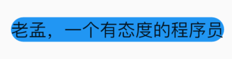
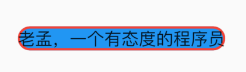
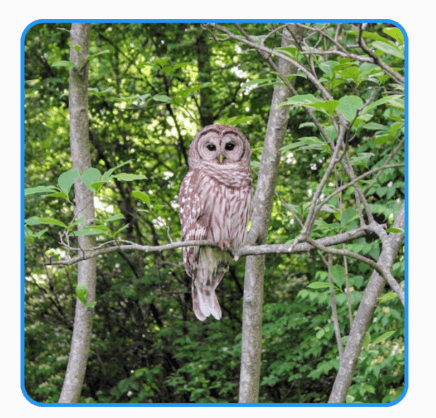
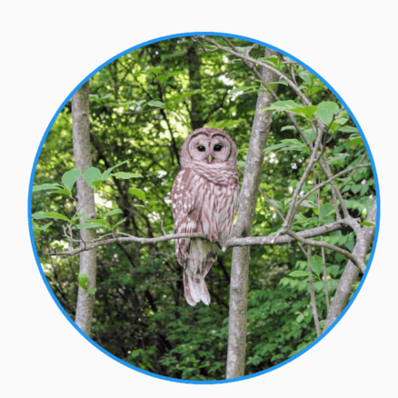
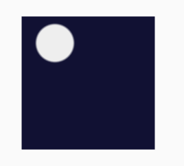

# DecoratedBox

DecoratedBox 是一个装饰类组件。

decoration属性可以设置子控件的背景颜色、形状等。通常使用**BoxDecoration**。

设置背景为矩形，颜色为蓝色，代码如下：

```dart
DecoratedBox(
	decoration: BoxDecoration(shape: BoxShape.rectangle, color: Colors.blue),
	child: Text('老孟，一个有态度的程序员'),
)
```

效果如下：


修改为圆角矩形，代码如下：

```dart
DecoratedBox(
        decoration: BoxDecoration(
            shape: BoxShape.rectangle,
            color: Colors.blue,
            borderRadius: BorderRadius.circular(20)),
        child: Text('老孟，一个有态度的程序员'),
      )
```

效果如下：


除了背景我们可以设置边框效果，代码如下：

```dart
DecoratedBox(
        decoration: BoxDecoration(
          shape: BoxShape.rectangle,
          color: Colors.blue,
          borderRadius: BorderRadius.circular(20),
          border: Border.all(
            color: Colors.red,
            width: 2,
          ),
        ),
        child: Text('老孟，一个有态度的程序员'),
      )
```

效果如下：

我们也可以通过此方式创建圆角图片和圆形图片，代码如下：

```dart
DecoratedBox(
        decoration: BoxDecoration(
          image:  DecorationImage(
            image: NetworkImage(
                'https://flutter.github.io/assets-for-api-docs/assets/widgets/owl-2.jpg'),
            fit: BoxFit.cover,
          ),
          border: Border.all(
            color: Colors.blue,
            width: 2,
          ),
          borderRadius: BorderRadius.circular(12),
        ),
        child: Container(
          height: 200,
          width: 200,
        ),
      )
```

效果如图：

修改其形状为圆形，代码如下：

```dart
DecoratedBox(
        decoration: BoxDecoration(
          image:  DecorationImage(
            image: NetworkImage(
                'https://flutter.github.io/assets-for-api-docs/assets/widgets/owl-2.jpg'),
            fit: BoxFit.cover,
          ),
          border: Border.all(
            color: Colors.blue,
            width: 2,
          ),
          shape: BoxShape.circle,
        ),
        child: Container(
          height: 200,
          width: 200,
        ),
      )
```

效果如图：


设置渐变色：

```dart
DecoratedBox(
  decoration: BoxDecoration(
    gradient: RadialGradient(
      center: const Alignment(-0.5, -0.6),
      radius: 0.15,
      colors: <Color>[
        const Color(0xFFEEEEEE),
        const Color(0xFF111133),
      ],
      stops: <double>[0.9, 1.0],
    ),
  ),
  child: Container(
    height: 100,
    width: 100,
  ),
)
```



