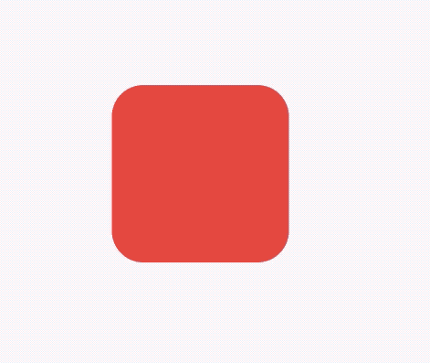

## DecoratedBoxTransition

外观装饰属性动画，用法如下：

```dart
class AnimationDemo extends StatefulWidget {
  @override
  State<StatefulWidget> createState() => _AnimationDemo();
}

class _AnimationDemo extends State<AnimationDemo>
    with SingleTickerProviderStateMixin {
  AnimationController _animationController;
  Animation _animation;

  @override
  void initState() {
    _animationController =
        AnimationController(duration: Duration(seconds: 2), vsync: this);

    _animation = DecorationTween(begin: BoxDecoration(
      color: Colors.red,
      borderRadius: BorderRadius.circular(15)
    ), end: BoxDecoration(
        color: Colors.blue,
        borderRadius: BorderRadius.circular(55)
    ))
        .animate(_animationController);

    //开始动画
    _animationController.forward();
    super.initState();
  }

  @override
  Widget build(BuildContext context) {
    return DecoratedBoxTransition(
      decoration: _animation,
      child: Container(
        height: 100,
        width: 100,
      ),
    );
  }

  @override
  void dispose() {
    _animationController.dispose();
    super.dispose();
  }
}
```

效果如下：



