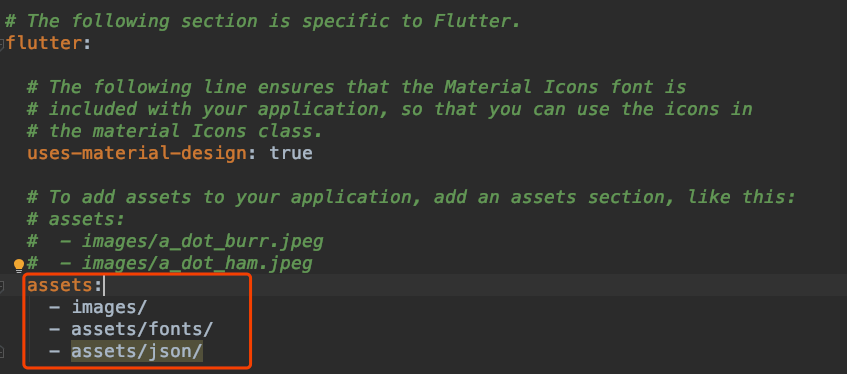

#  DefaultAssetBundle

通常情况下，使用DefaultAssetBundle读取asset资源文件，比如读取json文件：

在`pubspec.yaml`中配置assets：




在项目中创建`assets/json/`文件夹，在此目录下创建`json`文件，读取：

```dart
DefaultAssetBundle.of(context).loadString("assets/json/data.json"),
```

其他文件也是一样的读取方式。