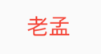

# DefaultTextStyle

适用于子控件[Text]的文本样式，除非显示指定样式。

```dart
DefaultTextStyle(
  style: TextStyle(color: Colors.red),
  child: Text('老孟'),
)
```



如果显示指定了样式，则使用显示指定的。

```dart
DefaultTextStyle(
  style: TextStyle(color: Colors.red),
  child: Text('老孟',style: TextStyle(color: Colors.blue),),
)
```


`softWrap`表示自动换行。

`overflow`表示超出部分如何处理，

```dart
Container(
  width: 150,
  color: Colors.red,
  child: DefaultTextStyle(
    style: TextStyle(fontSize: 18),
    overflow: TextOverflow.ellipsis,
    child: Text('老孟Flutter，专注分享Flutter相关技术'),
  ),
)
```


超出部分处理方式：

-  clip：直接截取
-  fade：渐隐
-  ellipsis：省略号形式
-  visible：可见