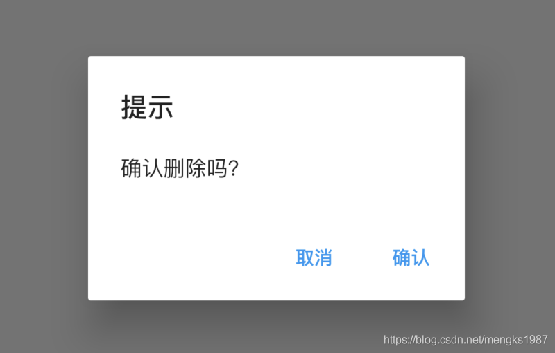
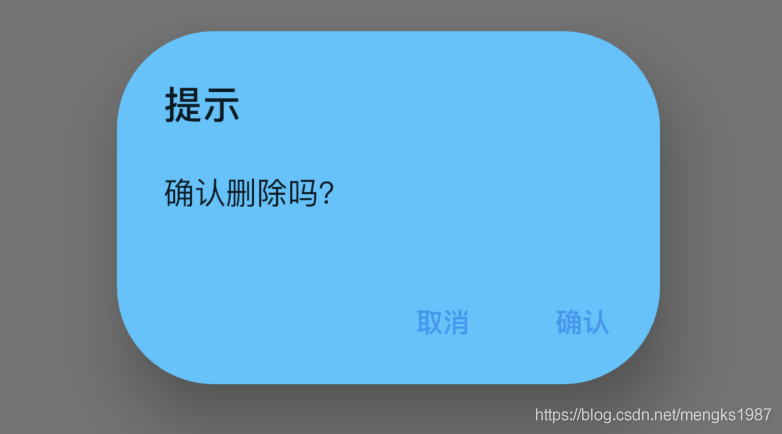
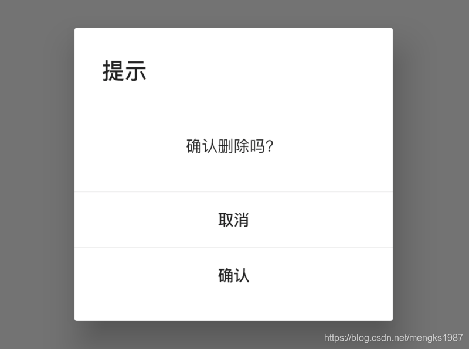

### AlertDialog

当应用程序进行重要操作时经常需要用户进行2次确认，以避免用户的误操作，比如删除文件时，一般会弹出提示“是否要删除当前文件”，用户点击确认后才会进行删除操作，这时我们可以使用提示框（AlertDialog或者CupertinoAlertDialog）。

根据设计的不同，我们可以选择Material风格的AlertDialog或者Cupertino（ios）风格的CupertinoAlertDialog，

Material风格基础用法如下：

```dart
RaisedButton(
  child: Text('切换'),
  onPressed: () {
    showDialog(
        context: context,
        builder: (context) {
          return AlertDialog(
            title: Text('提示'),
            content: Text('确认删除吗？'),
            actions: <Widget>[
              FlatButton(child: Text('取消'),onPressed: (){},),
              FlatButton(child: Text('确认'),onPressed: (){},),
            ],
          );
        });
  },
)
```

Material风格效果：



AlertDialog的属性相对比较丰富，可以设置title样式、content样式、背景颜色、阴影值，设置是形状：

```dart
AlertDialog(
  title: Text('提示'),
  content: Text('确认删除吗？'),
  backgroundColor: Colors.lightBlueAccent,
  elevation: 24,
  shape: RoundedRectangleBorder(borderRadius: BorderRadius.circular(50)),
  actions: <Widget>[
    FlatButton(child: Text('取消'),onPressed: (){},),
    FlatButton(child: Text('确认'),onPressed: (){},),
  ],
)
```




用户点击“取消”或者“确定”按钮后退出对话框，App需要知道知道用户选择了哪个选项，用法如下：

```dart
RaisedButton(
  child: Text('切换'),
  onPressed: () async {
    var result = await showDialog(
        context: context,
        builder: (context) {
          return AlertDialog(
            title: Text('提示'),
            content: Text('确认删除吗？'),
            actions: <Widget>[
              FlatButton(
                child: Text('取消'),
                onPressed: () {
                  Navigator.of(context).pop('cancel');
                },
              ),
              FlatButton(
                child: Text('确认'),
                onPressed: () {
                  Navigator.of(context).pop('ok');
                },
              ),
            ],
          );
        });
    print('$result');
  },
)
```


### CupertinoAlertDialog

Cupertino（ios）风格基础用法如下：

```dart
RaisedButton(
  child: Text('切换'),
  onPressed: () {
    showCupertinoDialog(
        context: context,
        builder: (context) {
          return CupertinoAlertDialog(
            title: Text('提示'),
            content: Text('确认删除吗？'),
            actions: <Widget>[
              CupertinoDialogAction(child: Text('取消'),onPressed: (){},),
              CupertinoDialogAction(child: Text('确认'),onPressed: (){},),
            ],
          );
        });
  },
)
```

Cupertino（ios）风格效果如下：


`showDialog`和`AlertDialog`配合使用展示Material风格对话框，`showCupertinoDialog`和`CupertinoAlertDialog`配合使用展示iOS风格对话框，`showCupertinoDialog`点击空白处是无法退出对话框的，而`showDialog`点击空白处默认退出对话框，`barrierDismissible`属性控制点击空白处的行为，用法如下：

```dart
showDialog(
    barrierDismissible: false,
    )
```

### SimpleDialog

如果你觉得系统提供的这2个风格的对话框不够个性，你可以试试SimpleDialog，用法和AlertDialog基本相同，如下：

```dart
SimpleDialog(
  title: Text('提示'),
  children: <Widget>[
    Container(
      height: 80,
      alignment: Alignment.center,

      child: Text('确认删除吗？'),
    ),
    Divider(height: 1,),
    FlatButton(
      child: Text('取消'),
      onPressed: () {
        Navigator.of(context).pop('cancel');
      },
    ),
    Divider(height: 1,),
    FlatButton(
      child: Text('确认'),
      onPressed: () {
        Navigator.of(context).pop('ok');
      },
    ),
  ],
)
```

效果如下：



### Dialog

如果你觉得这还是不够个性，那可以祭出终极大招了，直接使用Dialog，Dialog可以定制任何对话框，只需将对话框的内容给child属性：

```dart
Dialog(
  child: MyDialog(),
);
```

当然一般情况下，系统提供的对话框就够用了，这几个对话框组件用法基本一样，不同的地方仅仅是灵活性和使用简易程度的不要，Dialog最灵活，但使用起来比AlertDialog复杂一些，AlertDialog使用起来非常简单，但布局和基本样式都已经固定好，不如Dialog灵活。


