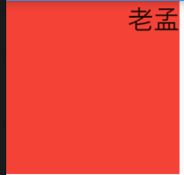

# Directionality

定义文本的方向，默认文本从左到右，但有些国家的文字从右到左，比如阿拉伯。

```dart
Container(
  height: 100,
  width: 100,
  color: Colors.red,
  child: Directionality(
    textDirection: TextDirection.rtl,
    child: Text('老孟'),
  ),
)
```



