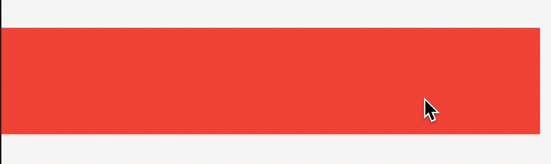
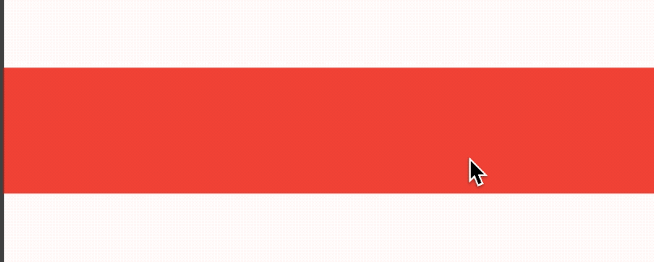
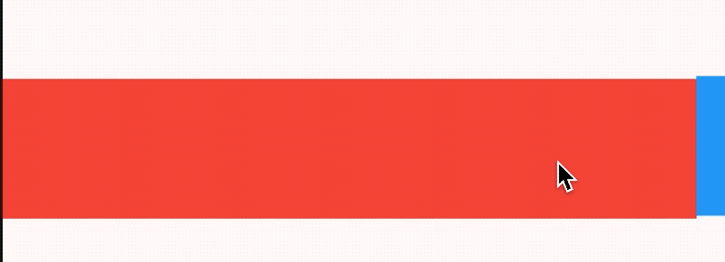

# Dismissible

Dismissible组件可通过左滑或者右滑清除列表项。


基本用法如下：

```dart
Dismissible(
  key: ValueKey('key'),
  child: Container(
    height: 80,
    color: Colors.red,
  ),
)
```

效果如下：



`background`和`secondaryBackground`都是背景组件，都是在child组件后面，如果`secondaryBackground`设置了值，那么`background`仅在向右或者下拖动时显示，`secondaryBackground`是当向左或者上拖动组件时显示。

`confirmDismiss`参数确认是否移除组件，需要返回`Future<bool>`，如果返回true，组件将会被移除，否则组件将会移动到原始的位置，而且返回false，`onDismissed`和`onResize`不会在调用，用法如下：

```dart
Dismissible(
  confirmDismiss:(DismissDirection direction) async{
    return false;
  },
  ...
)
```

效果如下：



`onResize`是当尺寸变化时调用，`onDismissed`组件移除时调用，用法如下：

```dart
Dismissible(
  onResize: (){
    print('onResize');
  },
  onDismissed: (DismissDirection direction){
    print('onDismissed:$direction');
  },
    ...
)
```

设置`direction`调整拖动消除的方向，用法如下：

```dart
Dismissible(
  direction: DismissDirection.vertical,
      ...
)
```

`resizeDuration`尺寸变化时长，注意在子组件移除后，`background`或者`secondaryBackground`有一个移除动画，设置如下：

```dart
Dismissible(
  resizeDuration: Duration(seconds: 1),
       ...
)
```

`dismissThresholds`参数表示拖动到什么程度才消除组件，默认是0.4，至少向右滑动80%才消除，用法如下：

```dart
Dismissible(
  dismissThresholds: {
    DismissDirection.endToStart:0.8
  },
        ...
)
```

`movementDuration`参数是消除组件或者回到原始位置的时间，用法如下：

```dart
Dismissible(
  movementDuration: Duration(seconds: 1),
  ...
)
```

`crossAxisEndOffset`参数表示交叉轴方向上偏移量，用法如下：

```dart
Dismissible(
  crossAxisEndOffset: 0.5,
    ...
)
```

效果如下：



