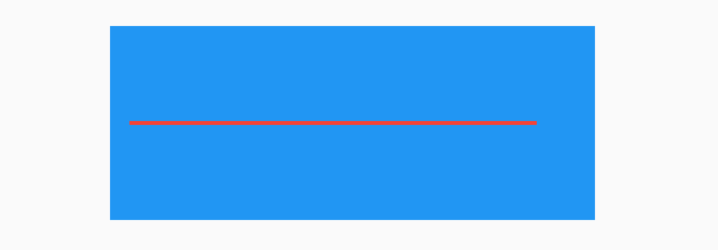
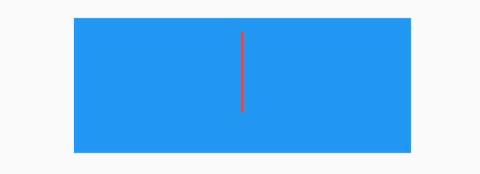

## Divider

Divider是一个分割线控件。基本用法如下：

```dart
Divider(
  height: 10,
  thickness: 5,
  color: Colors.red,
  indent: 10,
  endIndent: 20,
)
```

`height`：是控件的高，并不是线的高度，绘制的线居中。

`thickness`：线的高度。

`indent`：分割线前面空白区域。

`endIndent`：分割线后面空白区域。

效果如下：



蓝色区域为父控件，红色为分割线。

## VerticalDivider

VerticalDivider 和Divider用法一样，Divider是水平分割线，而VerticalDivider是垂直分割线，用法如下：

```dart
VerticalDivider(
  width: 20,
  thickness: 2,
  color: Colors.red,
  indent: 10,
  endIndent: 30,
)
```

效果如下：




## 全局设置

在MaterialApp中对分割线进行全局属性设置：

```dart
MaterialApp(
	...
	theme: ThemeData(
    dividerTheme: DividerThemeData(
    ),
    ...
  ),
)
```

`DividerThemeData`的属性和Divider基本一样，唯一一个不同的就是`space`，`space`对应Divider的`height`和VerticalDivider中的`width`。

<font color='red'> 注意： 1.12.13+hotfix.5 • channel stable 源代码中说明如下：</font>

```dart
/// The [Divider]'s width or the [VerticalDivider]'s height.
///
/// This represents the amount of horizontal or vertical space the divider
/// takes up.
final double space;
```

这个说明是错误的，看下Divider实现源代码：

```dart
@override
Widget build(BuildContext context) {
  final DividerThemeData dividerTheme = DividerTheme.of(context);
  final double height = this.height ?? dividerTheme.space ?? 16.0;
  final double thickness = this.thickness ?? dividerTheme.thickness ?? 0.0;
  final double indent = this.indent ?? dividerTheme.indent ?? 0.0;
  final double endIndent = this.endIndent ?? dividerTheme.endIndent ?? 0.0;

  return SizedBox(
    height: height,
    child: Center(
      child: Container(
        height: thickness,
        margin: EdgeInsetsDirectional.only(start: indent, end: endIndent),
        decoration: BoxDecoration(
          border: Border(
            bottom: createBorderSide(context, color: color, width: thickness),
          ),
        ),
      ),
    ),
  );
}
```

`height`的值定义如下：

```dart
final double height = this.height ?? dividerTheme.space ?? 16.0;
```

所以dividerTheme.space的值代表Divider的`height`。

