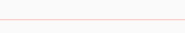

# DividerTheme

用于**Divider**或者**VerticalDividers**组件的样式。

```dart
DividerTheme(
  data: DividerThemeData(
    color: Colors.red
  ),
  child: Divider(),
)
```




## DividerThemeData

分割线样式说明

```dart
const DividerThemeData({
  this.color,//分割线颜色
  this.space,//分割线宽度（Divider）或者高度（VerticalDivider），这只是控件的宽/高，不是实际绘制线的宽/高
  this.thickness,//实际绘制线的宽/高
  this.indent,//分割线前面的空白区域
  this.endIndent,//分割线后面的空白区域
});
```

