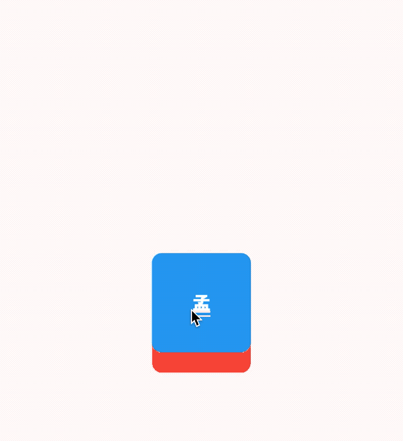
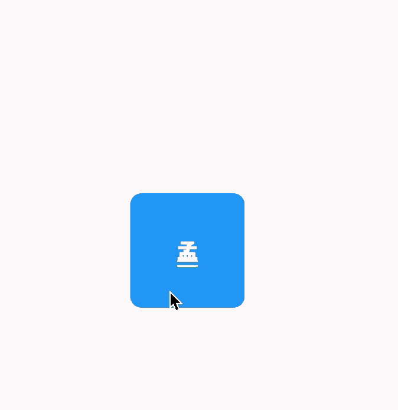
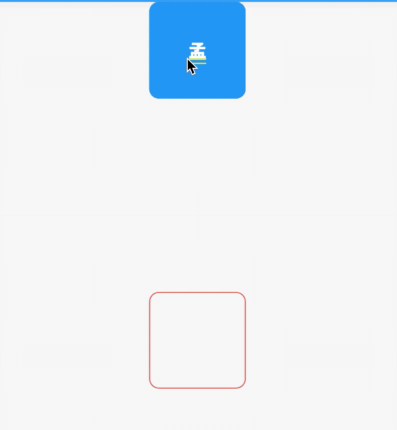

# Draggable

Draggable系列组件可以让我们拖动组件。

## Draggable

Draggable组件有2个必须填写的参数，`child`参数是子控件，`feedback`参数是拖动时跟随移动的组件，用法如下：

```dart
Draggable(
  child: Container(
    height: 100,
    width: 100,
    alignment: Alignment.center,
    decoration: BoxDecoration(
      color: Colors.red,
      borderRadius: BorderRadius.circular(10)
    ),
    child: Text('孟',style: TextStyle(color: Colors.white,fontSize: 18),),
  ),
  feedback: Container(
    height: 100,
    width: 100,
    alignment: Alignment.center,
    decoration: BoxDecoration(
        color: Colors.blue,
        borderRadius: BorderRadius.circular(10)
    ),
    child: Text('孟',style: TextStyle(color: Colors.white,fontSize: 18),),
  ),
)
```

效果如下：



蓝色的组件是`feedback`，如果想在拖动的时候子组件显示其他样式可以使用`childWhenDragging`参数，用法如下：

```dart
Draggable(
  childWhenDragging: Container(
    height: 100,
    width: 100,
    alignment: Alignment.center,
    decoration: BoxDecoration(
        color: Colors.grey, borderRadius: BorderRadius.circular(10)),
    child: Text(
      '孟',
      style: TextStyle(color: Colors.white, fontSize: 18),
    ),
  ),
  ...
)
```

效果如下：



我们还可以控制拖动的方向，比如只允许垂直方向移动，代码如下：

```dart
Draggable(
  axis: Axis.vertical,
  ...
)
```


Draggable组件为我们提供了4中拖动过程中的回调事件，用法如下：

```dart
Draggable(
  onDragStarted: (){
    print('onDragStarted');
  },
  onDragEnd: (DraggableDetails details){
    print('onDragEnd:$details');
  },
  onDraggableCanceled: (Velocity velocity, Offset offset){
    print('onDraggableCanceled velocity:$velocity,offset:$offset');
  },
  onDragCompleted: (){
    print('onDragCompleted');
  },
  ...
)
```

说明如下：

- onDragStarted：开始拖动时回调。
- onDragEnd：拖动结束时回调。
- onDraggableCanceled：未拖动到DragTarget控件上时回调。
- onDragCompleted：拖动到DragTarget控件上时回调。

Draggable有一个`data`参数，这个参数是和DragTarget配合使用的，当用户将控件拖动到DragTarget时此数据会传递给DragTarget。

## DragTarget


DragTarget就像他的名字一样，指定一个目的地，Draggable组件可以拖动到此控件，用法如下：

```dart
DragTarget(
  builder: (BuildContext context, List<dynamic> candidateData,
      List<dynamic> rejectedData) {
      ...
  }
)
```

当`onWillAccept`返回true时， `candidateData`参数的数据是Draggable的`data`数据。

当`onWillAccept`返回false时， `rejectedData`参数的数据是Draggable的`data`数据，

DragTarget有3个回调，说明如下：

- onWillAccept：拖到该控件上时调用，需要返回true或者false，返回true，松手后会回调onAccept，否则回调onLeave。
- onAccept：onWillAccept返回true时，用户松手后调用。
- onLeave：onWillAccept返回false时，用户松手后调用。

用法如下：

```dart
var _dragData;

@override
Widget build(BuildContext context) {
  return Center(
    child: Column(
      children: <Widget>[
        _buildDraggable(),
        SizedBox(
          height: 200,
        ),
        DragTarget<Color>(
          builder: (BuildContext context, List<Color> candidateData,
              List<dynamic> rejectedData) {
            print('candidateData:$candidateData,rejectedData:$rejectedData');
            return _dragData == null
                ? Container(
                    height: 100,
                    width: 100,
                    alignment: Alignment.center,
                    decoration: BoxDecoration(
                        borderRadius: BorderRadius.circular(10),
                        border: Border.all(color: Colors.red)),
                  )
                : Container(
                    height: 100,
                    width: 100,
                    alignment: Alignment.center,
                    decoration: BoxDecoration(
                        color: Colors.red,
                        borderRadius: BorderRadius.circular(10)),
                    child: Text(
                      '孟',
                      style: TextStyle(color: Colors.white, fontSize: 18),
                    ),
                  );
          },
          onWillAccept: (Color color) {
            print('onWillAccept:$color');
            return true;
          },
          onAccept: (Color color) {
            setState(() {
              _dragData = color;
            });
            print('onAccept:$color');
          },
          onLeave: (Color color) {
            print('onLeave:$color');
          },
        ),
      ],
    ),
  );
}

_buildDraggable() {
  return Draggable(
    data: Color(0x000000FF),
    child: Container(
      height: 100,
      width: 100,
      alignment: Alignment.center,
      decoration: BoxDecoration(
          color: Colors.red, borderRadius: BorderRadius.circular(10)),
      child: Text(
        '孟',
        style: TextStyle(color: Colors.white, fontSize: 18),
      ),
    ),
    feedback: Container(
      height: 100,
      width: 100,
      alignment: Alignment.center,
      decoration: BoxDecoration(
          color: Colors.blue, borderRadius: BorderRadius.circular(10)),
      child: DefaultTextStyle.merge(
        style: TextStyle(color: Colors.white, fontSize: 18),
        child: Text(
          '孟',
        ),
      ),
    ),
  );
}
```

效果如下：




## LongPressDraggable

LongPressDraggable继承自Draggable，因此用法和Draggable完全一样，唯一的区别就是LongPressDraggable触发拖动的方式是长按，而Draggable触发拖动的方式是按下。