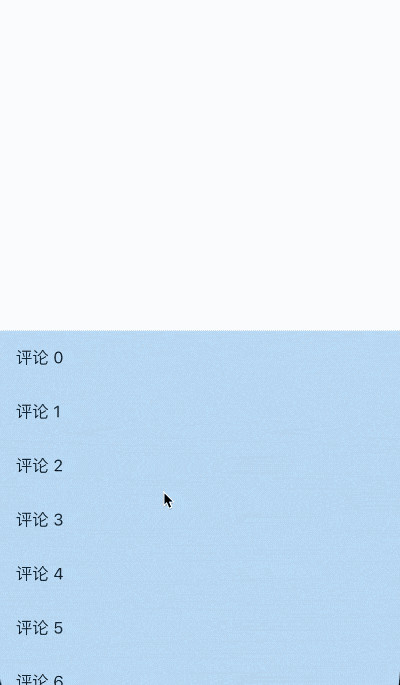

# DraggableScrollableActuator

通知子控件[DraggableScrollableSheet](http://laomengit.com/flutter/widgets/DraggableScrollableSheet.html)重置其位置到初始化状态，调用`DraggableScrollableActuator.reset(context)`方法即可。

```dart
DraggableScrollableActuator(child: DraggableScrollableSheet(
    builder:
        (BuildContext context, ScrollController scrollController) {
  return Container(
    color: Colors.blue[100],
    child: ListView.builder(
      controller: scrollController,
      itemCount: 100,
      itemBuilder: (BuildContext context, int index) {
        return ListTile(
          title: Text('评论 $index'),
          onTap: () {
            DraggableScrollableActuator.reset(context);
          },
        );
      },
    ),
  );
}))
```

点击时调用`DraggableScrollableActuator.reset(context)`，立即回到初始位置，



