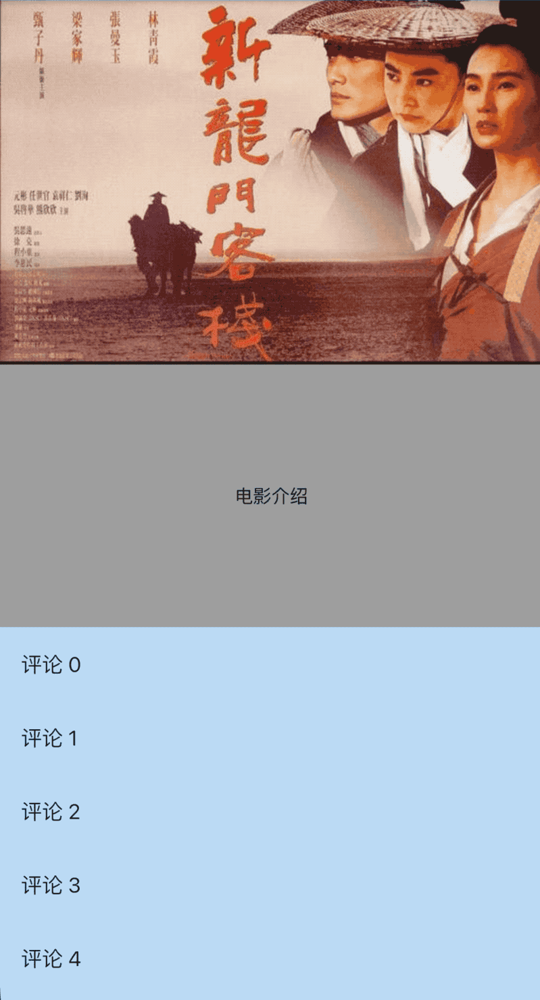

# DraggableScrollableSheet

DraggableScrollableSheet组件可以在屏幕上拖动，`builder`属性需要返回其子控件，可以是任何类型的子控件，一般返回一个ListView，用法如下：

```dart
DraggableScrollableSheet(
    builder:
        (BuildContext context, ScrollController scrollController) {
      return Container(
        color: Colors.blue[100],
        child: ListView.builder(
          controller: scrollController,
          itemCount: 100,
          itemBuilder: (BuildContext context, int index) {
            return ListTile(title: Text('评论 $index'));
          },
        ),
      );
    })
```

还可以设置其初始尺寸、最大尺寸和最小尺寸，用法如下：

```dart
DraggableScrollableSheet(
    initialChildSize: 0.4,
    minChildSize: 0.4,
    maxChildSize: 1,
  	...
    )
```

`expand`属性表示是否充满父组件，大部分情况下设置true，如果父组件将根据其所需大小来定位此组件时需要设置为false，比如Center，设置如下：

```dart
DraggableScrollableSheet(
  expand: false,
  ...
  )
```


一个电影的详情介绍页面，包含顶部的海报图、中间介绍部分以及底部的评论部分，在滑动评论的时候希望评论能滑到顶部，这样用户的体验会非常好，效果如下：



实现此效果的代码：

```dart
@override
Widget build(BuildContext context) {
  return Stack(
    children: <Widget>[
      Column(
        children: <Widget>[
          Image.network(
              'https://timgsa.baidu.com/timg?image&quality=80&size=b9999_10000&sec=1583224371276&di=c8a9d759bdde3218aef0f24268f11ab2&imgtype=0&src=http%3A%2F%2Fi1.sinaimg.cn%2Fent%2Fr%2F2009-03-27%2FU2507P28T3D2441286F328DT20090327082744.jpg'),
          Container(
            height: 200,
            color: Colors.grey,
            alignment: Alignment.center,
            child: Text('电影介绍'),
          ),
        ],
      ),
      Positioned.fill(
          child: DraggableScrollableSheet(
            expand: false,
              initialChildSize: 0.4,
              minChildSize: 0.4,
              maxChildSize: 1,
              builder:
                  (BuildContext context, ScrollController scrollController) {
                return Container(
                  color: Colors.blue[100],
                  child: ListView.builder(
                    controller: scrollController,
                    itemCount: 100,
                    itemBuilder: (BuildContext context, int index) {
                      return ListTile(title: Text('评论 $index'));
                    },
                  ),
                );
              }))
    ],
  );
}
```

