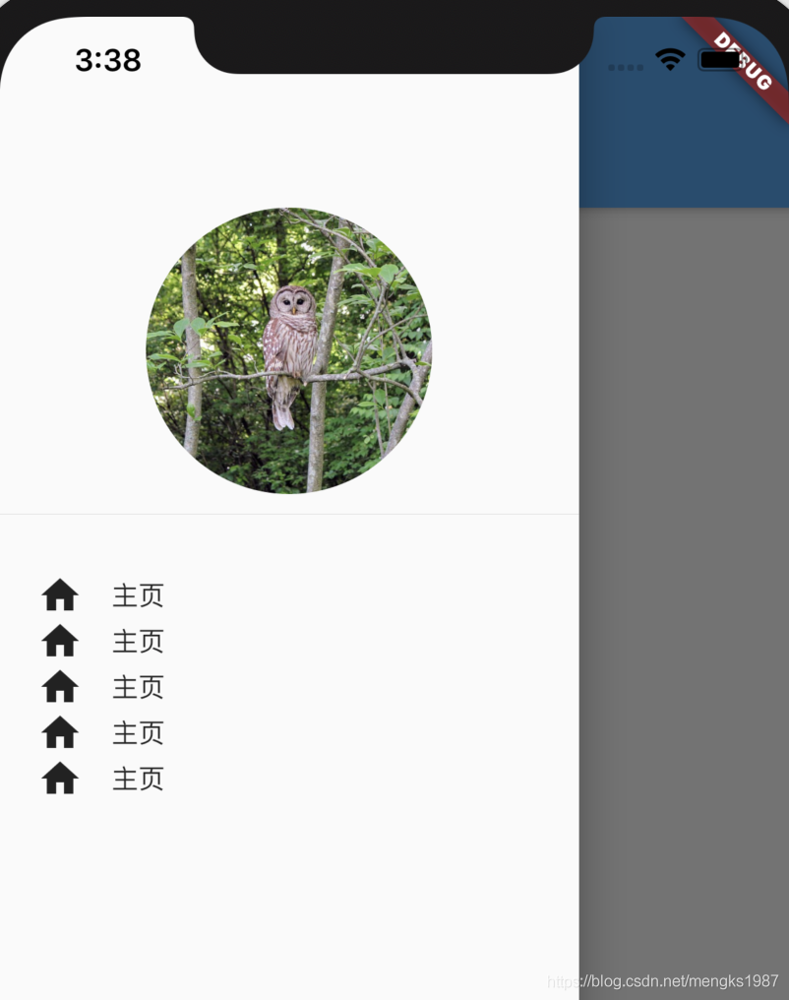

# Drawer

Drawer是一个抽屉导航组件，导航一般使用底部导航BottomNavigationBar或者抽屉导航。

Drawer一般和Scaffold组合使用，用法如下：

```
Scaffold(
	drawer: Drawer(),
)
```
如果设置了AppBar，而没有设置AppBar的`leading`属性，在AppBar的左侧默认出现抽屉的图标，用法如下：
```
Scaffold(
	appBar: AppBar(),
	drawer: Drawer(),
)
```
效果如下：


可以通过点击这个抽屉图标或者从屏幕左侧向右侧滑动打开抽屉，打开抽屉效果如下：



也可以设置Scaffold的`endDrawer`属性，在右侧显示一个Drawer，代码如下：
```
Scaffold(
	endDrawer: Drawer(),
)
```
通过代码的方式打开Drawer，需要获取Scaffold状态，用法如下：
```
RaisedButton(
          child: Text(
            '点我，弹出Drawer',
          ),
          onPressed: () {
            Scaffold.of(context).openDrawer();
          },
        )
```

取消Drawer也很容易，向左滑动即可，当然也可以通过代码的方式控制：
```
RaisedButton(
          child: Text(
            '点我，隐藏Drawer',
          ),
          onPressed: () {
            Navigator.of(context).pop();
          },
        )
```

Drawer里面可以放置任何组件，但是一般使用ListView，分为DrawerHeader和ListTiles，用法如下：
```
drawer: Drawer(
          child: ListView(
            children: <Widget>[
              DrawerHeader(),
              ListTile(),
              ListTile(),
              ListTile(),
              ListTile(),
            ],
          ),
        ),
```


