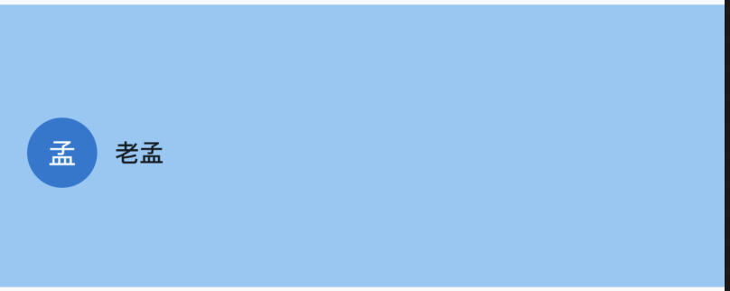
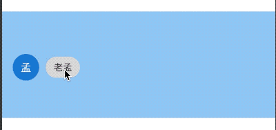

# DrawerHeader

通常用于`Drawer`组件的顶部区域，DrawerHeader本质上是一个Container，用法如下：

```dart
DrawerHeader(
  decoration: BoxDecoration(
    color: Colors.blue.withOpacity(.5)
  ),
  child: Row(
    children: <Widget>[
      CircleAvatar(
        child: Text('孟'),
      ),
      SizedBox(width: 10,),
      Text('老孟')
    ],
  ),
)
```

效果如下：



当外形发生变化时，会有动画过度：

```dart
DrawerHeader(
  decoration: BoxDecoration(
    color: _color
  ),
  duration: Duration(seconds: 1),
  child: Row(
    children: <Widget>[
      CircleAvatar(
        child: Text('孟'),
      ),
      SizedBox(width: 10,),
      ActionChip(
        label: Text('老孟'),
        onPressed: (){
          setState(() {
            _color = Colors.red.withOpacity(.5);
          });
        },
      )
    ],
  ),
)
```

效果如下：



