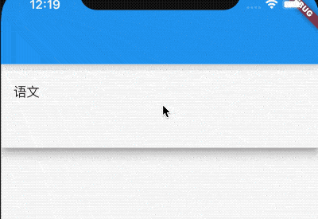
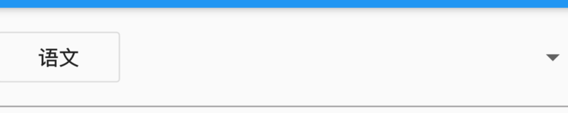
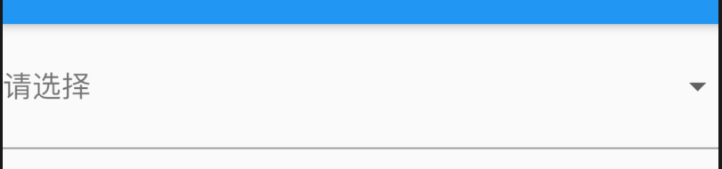

# DropdownButtonFormField

DropdownButtonFormField 是一个组合控件，将[DropdownButton]包装在[FormField]中，用法如下：

```dart
var _value='语文';

@override
Widget build(BuildContext context) {
  return DropdownButtonFormField(
    value: _value,
    items: [
      DropdownMenuItem(
        child: Text('语文'),
        value: '语文',
      ),
      DropdownMenuItem(child: Text('数学'), value: '数学'),
      DropdownMenuItem(child: Text('英语'), value: '英语'),
    ],
    onChanged: (String value){
      setState(() {
        _value = value;
      });
    },
  );
}
```




`selectedItemBuilder`用于自定义选中item的控件，此属性的子控件要和items一一对应，

```dart
DropdownButtonFormField(
  items: [
    DropdownMenuItem(
      child: Text('语文'),
      value: '语文',
    ),
    DropdownMenuItem(child: Text('数学'), value: '数学'),
    DropdownMenuItem(child: Text('英语'), value: '英语'),
  ],
  selectedItemBuilder: (context) {
    return [
      OutlineButton(child: Text('语文'),onPressed: (){},),
      OutlineButton(child: Text('数学'),onPressed: (){},),
      OutlineButton(child: Text('英语'),onPressed: (){},),
    ];
  },
  ...
)
```




当value为null时，设置提示

```dart
DropdownButtonFormField(
  hint: Text('请选择'),
  value: null,
  ...
)
```



`decoration`是装饰属性，具体信息查看[InputDecoration](http://laomengit.com/flutter/widgets/InputDecoration.html)

`onSaved`和`validator`是[FormField](http://laomengit.com/flutter/widgets/Form.html#formfield)组件的相关参数。

而剩余属性均为[DropdownButton](http://laomengit.com/flutter/widgets/Button.html#dropdownbutton)属性。

