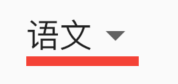

# DropdownButtonHideUnderline


DropdownButtonHideUnderline 这个控件非常特别，因为其他控件是添加UI，而此控件是为了减少控件，如果DropdownButton是DropdownButtonHideUnderline的子控件，那么DropdownButton的下划线将不会起作用，要不是看源代码还真是无法理解这个控件的作用。


没有使用DropdownButtonHideUnderline的DropdownButton，代码如下：

```dart
var _dropValue = '语文';

DropdownButton(
  value: _dropValue,
  underline: Divider(
    color: Colors.red,
    height: 5,
    thickness: 5,
  ),
  items: [
    DropdownMenuItem(
      child: Text('语文'),
      value: '语文',
    ),
    DropdownMenuItem(child: Text('数学'), value: '数学'),
    DropdownMenuItem(child: Text('英语'), value: '英语'),
  ],
  onChanged: (value) {
    setState(() {
      _dropValue = value;
    });
  },
)
```



使用DropdownButtonHideUnderline包裹：

```dart
DropdownButtonHideUnderline(
  child: DropdownButton()
)
```


和上面相比较，红色下划线消失了。


