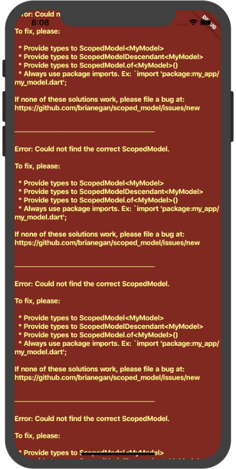
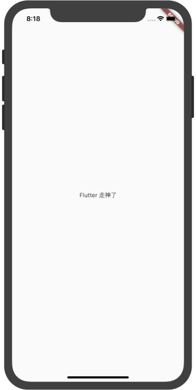

## ErrorWidget

屏蔽错误页面组件，`ErrorWidget`的构造函数的参数是exception的对象，然后返回一个内容是exception message信息的RenderBox.

正常错误页面



要想Flutter的错误页面显示成自定义的页面，只要设置`ErrorWidget`的`builder`就行

```dart
ErrorWidget.builder = (FlutterErrorDetails flutterErrorDetails){
    print(flutterErrorDetails.toString());
    return Center(
        child: Text("Flutter 走神了"),
    );
};
```


ErrorWidget.builder 返回一个Widget，当Flutter出错的时候就会显示这个Widget。



## ErrorWidget用法

ErrorWidget组件在build Widget的过程中调用。

案例

```dart
Widget built;
try {
    built = build();
} catch (e, stack) {
    //ErrorWidget.builder
    built = ErrorWidget.builder(_debugReportException('building $this', e, stack));
} 

try {
    built = build();
} catch (exception, stack) {
    //FlutterErrorDetails
    final FlutterErrorDetails details = FlutterErrorDetails(
        exception: exception,
        stack: stack,
        library: 'widgets library',
        context: 'attaching to the render tree'
    );
    FlutterError.reportError(details);
    final Widget error = ErrorWidget.builder(details);
    built = updateChild(null, error, _rootChildSlot);
}

```

本文由[**Rock**]()提供。


