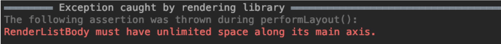
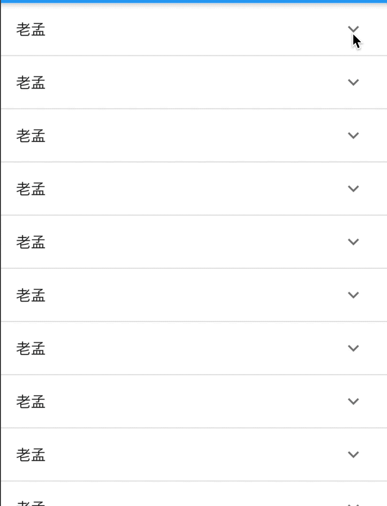

# ExpansionPanelList

ExpansionPanelList 提供了ListView下展开/关闭的控件。

基本用法如下：

```dart
List<bool> dataList = List.generate(20, (index) => false).toList();
return SingleChildScrollView(
  child: Container(
    child: _buildExpansionPanelList(),
  ),
);

_buildExpansionPanelList() {
    return ExpansionPanelList(
      expansionCallback: (index, isExpanded) {
        setState(() {
          dataList[index] = !isExpanded;
        });
      },
      children: dataList.map((value) {
        return ExpansionPanel(
          isExpanded: value,
          headerBuilder: (context, isExpanded) {
            return ListTile(
              title: Text('老孟'),
            );
          },
          body: Container(
            height: 100,
            color: Colors.greenAccent,
          ),
        );
      }).toList(),
    );
  }
```

注意ExpansionPanelList要被SingleChildScrollView包裹，否则抛出如下异常：



ExpansionPanelList效果如下：




`expansionCallback`为展开/关闭回调，返回展开/关闭子控件的索引及状态。

