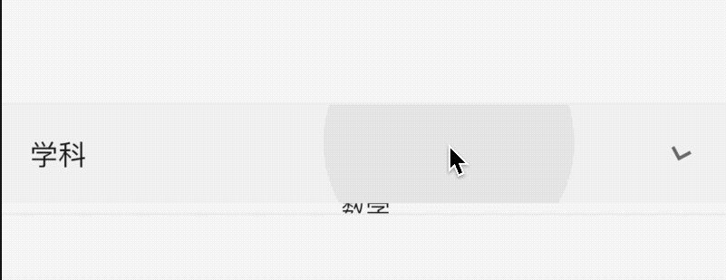

# ExpansionTile

 ExpansionTile 组件是分组组件，点击尾部的按钮打开/关闭子控件。

基本用法如下：

```dart
ExpansionTile(
  title: Text('学科'),
  children: <Widget>[
    Text('英语'),
    Text('数学'),
    Text('语文')
  ],
)
```

效果如下：



设置头部图标、子标题、背景颜色：

```dart
ExpansionTile(
  leading: Icon(Icons.home),
  subtitle: Text('各种学科'),
  backgroundColor: Colors.greenAccent,
  title: Text('学科'),
  children: <Widget>[
    Text('英语'),
    Text('数学'),
    Text('语文')
  ],
)
```

效果如下：


`initiallyExpanded`表示是否打开，用法如下：

```dart
ExpansionTile(
  initiallyExpanded: true,
  ...
)
```

`onExpansionChanged`打开/关闭回调：

```dart
ExpansionTile(
  onExpansionChanged: (bool value) {},
  ...
)
```


