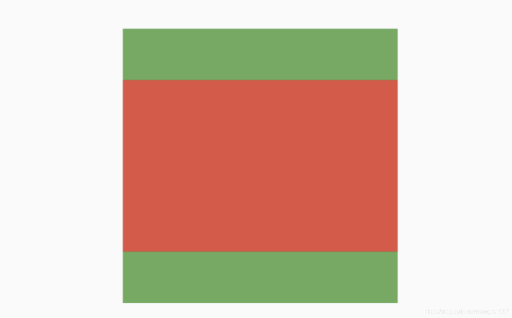

# FittedBox

当子组件的宽高比和父组件的宽高比不一样时，我们等比拉伸或者填充父组件，这时我们可以使用FittedBox，用法如下：

```dart
Container(
  height: 200,
  width: 200,
  color: Colors.green,
  child: FittedBox(
    child: Container(
      height: 50,
      width: 80,
      color: Colors.red,
    ),
  ),
)
```

效果如下：



`fit`参数表示了子控件的填充方式，说明如下：

- fill：填充父组件，宽高比发生变化。
- contain：等比拉伸，但子控件不能超出父控件。
- cover：尽可能的小，等比拉伸充满父控件。
- fitWidth：等比拉伸，宽充满父控件。
- fitHeight：等比拉伸，高充满父控件。
- none：默认子控件居中，不做拉伸处理，超出父控件的部分裁剪。
- scaleDown：在子控件为Image且缩小的情况和`contain`一样，否则和`none`一样。


