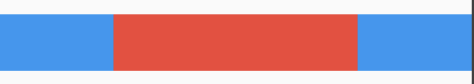
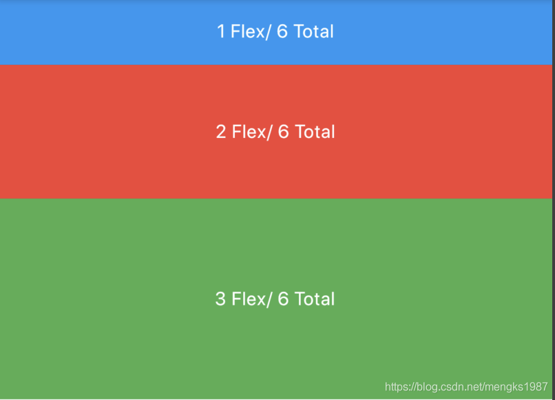
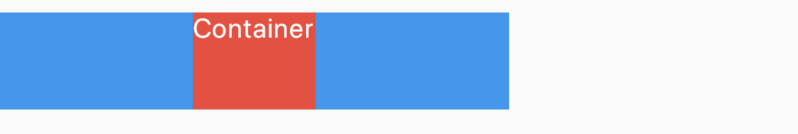
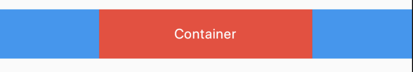
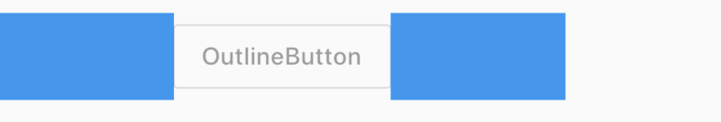
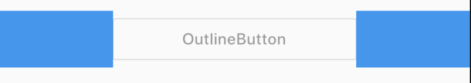

# Flexible

Expanded、Flexible和Spacer都是具有权重属性的组件，可以控制Row、Column、Flex的子控件如何布局的控件。

## Flexible

Flexible组件可以控制Row、Column、Flex的子控件占满父控件，比如，Row中有3个子控件，2边的固定宽，中间的占满剩余的空间，代码如下：

```
Row(
      children: <Widget>[
        Container(
          color: Colors.blue,
          height: 50,
          width: 100,
        ),
        Flexible(
            child: Container(
              color: Colors.red,
              height: 50,
            )
        ),
        Container(
          color: Colors.blue,
          height: 50,
          width: 100,
        ),
      ],
    )
```

效果如图：


还是有3个子控件，希望第一个占1/6，第二个占2/6，第三个占3/6，代码如下：

```
Column(
      children: <Widget>[
        Flexible(
          flex: 1,
          child: Container(
            color: Colors.blue,
            alignment: Alignment.center,
            child: Text('1 Flex/ 6 Total',style: TextStyle(color: Colors.white),),
          ),
        ),
        Flexible(
          flex: 2,
          child: Container(
            color: Colors.red,
            alignment: Alignment.center,
            child: Text('2 Flex/ 6 Total',style: TextStyle(color: Colors.white),),
          ),
        ),
        Flexible(
          flex: 3,
          child: Container(
            color: Colors.green,
            alignment: Alignment.center,
            child: Text('3 Flex/ 6 Total',style: TextStyle(color: Colors.white),),
          ),
        ),
      ],
    )
```

效果如图：


子控件占比 = 当前子控件flex/所有子控件flex之和。

Flexible中`fit`参数表示填满剩余空间的方式，说明如下：

- tight：必须（强制）填满剩余空间。
- loose：尽可能大的填满剩余空间，但是可以不填满。

这2个看上去不是很好理解啊，什么叫尽可能大的填满剩余空间？什么时候填满？看下面的例子：

```
Row(
      children: <Widget>[
        Container(
          color: Colors.blue,
          height: 50,
          width: 100,
        ),
        Flexible(
            child: Container(
              color: Colors.red,
              height: 50,
			  child: Text('Container',style: TextStyle(color: Colors.white),),
            )
        ),
        Container(
          color: Colors.blue,
          height: 50,
          width: 100,
        ),
      ],
    )
```

效果图：


这段代码是在最上面代码的基础上给中间的红色Container添加了Text子控件，此时红色Container就不在充满空间，再给Container添加对齐方式，代码如下：

```
Row(
      children: <Widget>[
        Container(
          color: Colors.blue,
          height: 50,
          width: 100,
        ),
        Flexible(
            child: Container(
              color: Colors.red,
              height: 50,
			  alignment: Alignment.center,
			  child: Text('Container',style: TextStyle(color: Colors.white),),
            )
        ),
        Container(
          color: Colors.blue,
          height: 50,
          width: 100,
        ),
      ],
    )
```

效果图：

此时又填满剩余空间。

大家是否还记得Container控件的大小是调整的吗？Container默认是适配子控件大小的，但当设置对齐方式时Container将会填满父控件，在[Flutter Widgets 之 Container](https://blog.csdn.net/mengks1987/article/details/104388393)中已经详细介绍，因此是否填满剩余空间取决于子控件是否需要填满父控件。

如果把Flexible中子控件由Container改为OutlineButton，代码如下：

```
Row(
      children: <Widget>[
        Container(
          color: Colors.blue,
          height: 50,
          width: 100,
        ),
        Flexible(
          child: OutlineButton(
            child: Text('OutlineButton'),
          ),
        ),
        Container(
          color: Colors.blue,
          height: 50,
          width: 100,
        ),
      ],
    )
```

OutlineButton正常情况下是不充满父控件的，因此最终的效果应该是不填满剩余空间，效果如图：



## Expanded

看一下Expanded的源代码：

```dart
class Expanded extends Flexible {
  /// Creates a widget that expands a child of a [Row], [Column], or [Flex]
  /// so that the child fills the available space along the flex widget's
  /// main axis.
  const Expanded({
    Key key,
    int flex = 1,
    @required Widget child,
  }) : super(key: key, flex: flex, fit: FlexFit.tight, child: child);
}
```

Expanded继承字Flexible，`fit`参数固定为`FlexFit.tight`，也就是说Expanded必须（强制）填满剩余空间。上面的OutlineButton想要充满剩余空间可以使用Expanded：

```
Row(
      children: <Widget>[
        Container(
          color: Colors.blue,
          height: 50,
          width: 100,
        ),
        Expanded(
          child: OutlineButton(
            child: Text('OutlineButton'),
          ),
        ),
        Container(
          color: Colors.blue,
          height: 50,
          width: 100,
        ),
      ],
    )
```

效果如图：



## Spacer


看下Spacer的build源代码：

```dart
@override
Widget build(BuildContext context) {
  return Expanded(
    flex: flex,
    child: const SizedBox.shrink(),
  );
}
```

Spacer的通过Expanded的实现的，和Expanded的区别是：Expanded可以设置子控件，而Spacer的子控件尺寸是0，因此Spacer适用于撑开Row、Column、Flex的子控件的空隙，用法如下：

```dart
Row(
  children: <Widget>[
    Container(width: 100,height: 50,color: Colors.green,),
    Spacer(flex: 2,),
    Container(width: 100,height: 50,color: Colors.blue,),
    Spacer(),
    Container(width: 100,height: 50,color: Colors.red,),
  ],
)
```

效果如下：


## 总结

总结如下：

- Spacer是通过Expanded来实现的，Expanded继承自Flexible。
- 填满剩余空间直接使用Expanded更方便。
- Spacer用于撑开Row、Column、Flex的子控件的空隙。


