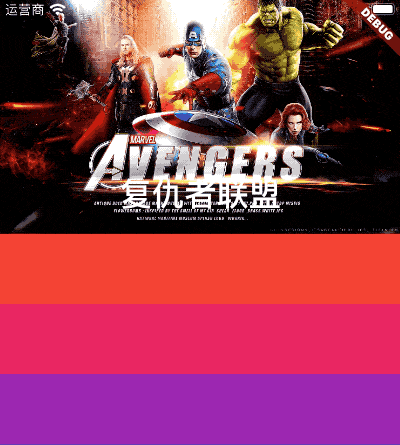
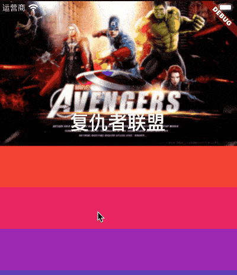

# FlexibleSpaceBar

**AppBar**的一部分，它可以扩展，折叠，延伸，最常用于**SliverAppBar.flexibleSpace**字段。

用法如下：

```dart
CustomScrollView(
  slivers: <Widget>[
    SliverAppBar(
      pinned: true,
      expandedHeight: 200.0,
      flexibleSpace: FlexibleSpaceBar(
        title: Text('复仇者联盟'),
        background: Image.network(
          'http://img.haote.com/upload/20180918/2018091815372344164.jpg',
          fit: BoxFit.fitHeight,
        ),
      ),
    ),
    SliverList(
      delegate: SliverChildBuilderDelegate((content, index) {
        return Container(
          height: 65,
          color: Colors.primaries[index % Colors.primaries.length],
        );
      }, childCount: 50),
    )
  ],
)
```

效果如下：



FlexibleSpaceBar中有一个非常重要的属性就是**stretchModes**，此参数控制拉伸区域的滚动特性：

- **StretchMode.zoomBackground-** >背景小部件将展开以填充额外的空间。
- **StretchMode.blurBackground-** >使用[ImageFilter.blur]效果，背景将模糊。
- **StretchMode.fadeTitle-** >随着用户过度滚动，标题将消失。

使用**stretchModes**属性需要开始**stretch**模式，用法如下：

```dart
SliverAppBar(
  pinned: true,
  expandedHeight: 200.0,
  stretch: true,
  flexibleSpace: FlexibleSpaceBar(
    stretchModes: [StretchMode.zoomBackground],
    ...
)
```

**stretchModes**为一个数组，3种模式可以组合使用，也可以单独使用，效果如下：


使用StretchMode.zoomBackground和StretchMode.blurBackground:

```dart
FlexibleSpaceBar(
  stretchModes: [StretchMode.zoomBackground,StretchMode.blurBackground],
  ...
)
```

效果如下：




我们还可以通过**stretchTriggerOffset** 和**onStretchTrigger**监听拉伸事件，用法如下：

```dart
SliverAppBar(
  stretch: true,
  stretchTriggerOffset: 100,
  onStretchTrigger: (){
    print('onStretchTrigger');
  },
  ...
)
```

注意此属性是在**SliverAppBar**中设置，但拉伸超过100时，将会回调**onStretchTrigger**函数。