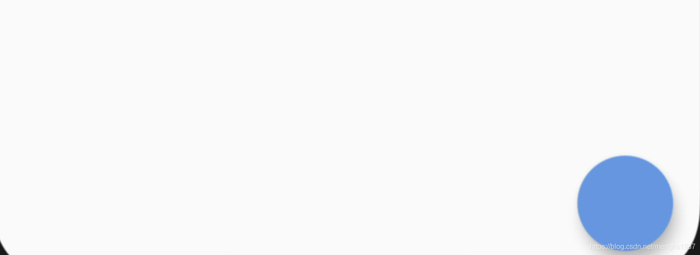
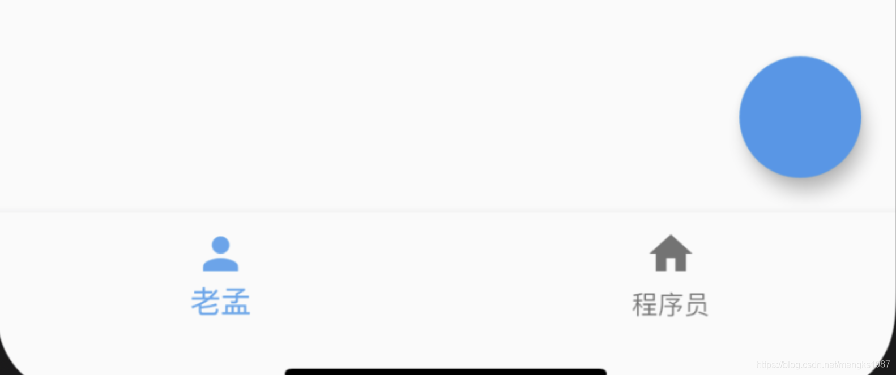
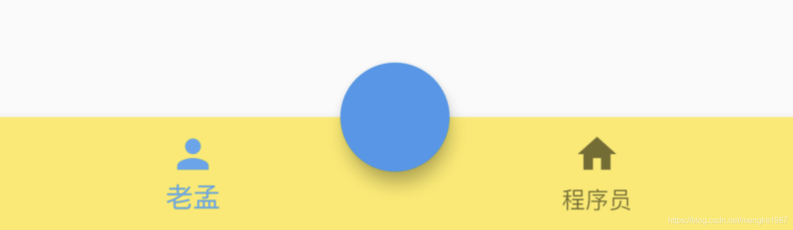

# FloatingActionButton

FloatingActionButton通常和Scaffold一起使用，在底部导航栏嵌入按钮。

基本用法如下：

```dart
Scaffold(
  floatingActionButton: FloatingActionButton(),
)
```

没有底部导航栏的位置如下：



加入底部导航栏：

```dart
Scaffold(
  floatingActionButton: FloatingActionButton(),
  bottomNavigationBar: BottomNavigationBar(
    items: [
      BottomNavigationBarItem(icon: Icon(Icons.person),title: Text('老孟')),
      BottomNavigationBarItem(icon: Icon(Icons.home),title: Text('程序员'))
    ],
  ),
)
```

效果如下：



设置按钮嵌入底部导航栏：

```dart
Scaffold(
  floatingActionButtonLocation: FloatingActionButtonLocation.centerDocked,
  floatingActionButton: FloatingActionButton(),
  bottomNavigationBar: BottomNavigationBar(
    backgroundColor: Colors.yellow,
    items: [
      BottomNavigationBarItem(icon: Icon(Icons.person),title: Text('老孟')),
      BottomNavigationBarItem(icon: Icon(Icons.home),title: Text('程序员'))
    ],
  )
)
```

用法如下：

