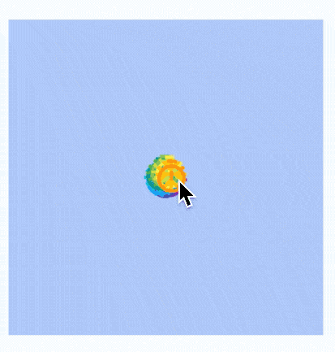
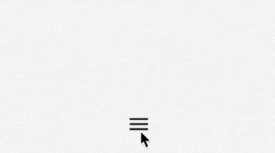

# Flow

流式小部件，同类型的有Wrap，Row等，Flow的特点是可以调整子组件的位置和大小，结合Matrix4绘制出各种酷炫的效果。

```dart
Flow({
    Key key, 
    @required FlowDelegate delegate, 	//继承FlowDelegate的管理类，来控制子组件的定位
    List<Widget> children: const []		//可放多个子组件
})
```

Flow仅有2个属性，`children`表示子控件，`delegate`是调整子组件的位置和大小，需要自定义。


## 水平展开/收起菜单

使用Flow实现水平展开/收起菜单的功能，代码如下：

```dart
class DemoFlowPopMenu extends StatefulWidget {
  @override
  _DemoFlowPopMenuState createState() => _DemoFlowPopMenuState();
}

class _DemoFlowPopMenuState extends State<DemoFlowPopMenu>
    with SingleTickerProviderStateMixin {
  //动画必须要with这个类
  AnimationController _ctrlAnimationPopMenu; //定义动画的变量
  IconData lastTapped = Icons.notifications;
  final List<IconData> menuItems = <IconData>[
    //菜单的icon
    Icons.home,
    Icons.new_releases,
    Icons.notifications,
    Icons.settings,
    Icons.menu,
  ];

  void _updateMenu(IconData icon) {
    if (icon != Icons.menu) {
      setState(() => lastTapped = icon);
    } else {
      _ctrlAnimationPopMenu.status == AnimationStatus.completed
          ? _ctrlAnimationPopMenu.reverse() //展开和收拢的效果
          : _ctrlAnimationPopMenu.forward();
    }
  }

  @override
  void initState() {
    super.initState();
    _ctrlAnimationPopMenu = AnimationController(
      //必须初始化动画变量
      duration: const Duration(milliseconds: 250), //动画时长250毫秒
      vsync: this, //SingleTickerProviderStateMixin的作用
    );
  }

//生成Popmenu数据
  Widget flowMenuItem(IconData icon) {
    final double buttonDiameter =
        MediaQuery.of(context).size.width * 2 / (menuItems.length * 3);
    return Padding(
      padding: const EdgeInsets.symmetric(vertical: 8.0),
      child: RawMaterialButton(
        fillColor: lastTapped == icon ? Colors.amber[700] : Colors.blue,
        splashColor: Colors.amber[100],
        shape: CircleBorder(),
        constraints: BoxConstraints.tight(Size(buttonDiameter, buttonDiameter)),
        onPressed: () {
          _updateMenu(icon);
        },
        child: Icon(icon, color: Colors.white, size: 30.0),
      ),
    );
  }

  @override
  Widget build(BuildContext context) {
    return Center(
      child: Flow(
        delegate: FlowMenuDelegate(animation: _ctrlAnimationPopMenu),
        children: menuItems
            .map<Widget>((IconData icon) => flowMenuItem(icon))
            .toList(),
      ),
    );
  }
}
```

FlowMenuDelegate定义如下：

```dart
class FlowMenuDelegate extends FlowDelegate {
  FlowMenuDelegate({this.animation}) : super(repaint: animation);
  final Animation<double> animation;

  @override
  void paintChildren(FlowPaintingContext context) {
    double x = 50.0; //起始位置
    double y = 50.0; //横向展开,y不变
    for (int i = 0; i < context.childCount; ++i) {
      x = context.getChildSize(i).width * i * animation.value;
      context.paintChild(
        i,
        transform: Matrix4.translationValues(x, y, 0),
      );
    }
  }

  @override
  bool shouldRepaint(FlowMenuDelegate oldDelegate) =>
      animation != oldDelegate.animation;
}
```


## 圆形展开/收起

使用Flow实现圆形展开/收起菜单的功能，代码如下：

```dart
class DemoFlowCircle extends StatefulWidget {
  @override
  _DemoFlowCircleState createState() => _DemoFlowCircleState();
}
class _DemoFlowCircleState extends State<DemoFlowCircle>
    with TickerProviderStateMixin {   //动画需要这个类来混合
  //动画变量,以及初始化和销毁
  AnimationController _ctrlAnimationCircle;
  @override
  void initState() {
    super.initState();
    _ctrlAnimationCircle = AnimationController(   //初始化动画变量
        lowerBound: 0,upperBound: 80,duration: Duration(seconds: 3),vsync: this);
    _ctrlAnimationCircle.addListener(() => setState(() {}));
  }
  @override
  void dispose() {
    _ctrlAnimationCircle.dispose();   //销毁变量,释放资源
    super.dispose();
  }
  //生成Flow的数据
  List<Widget> _buildFlowChildren() {
    return List.generate(
        15,
            (index) => Container(
          child: Icon(
            index.isEven ? Icons.timer : Icons.ac_unit,
            color: Colors.primaries[index % Colors.primaries.length],
          ),
        ));
  }
//系统生成页面
  @override
  Widget build(BuildContext context) {
    return Center(
      child: GestureDetector(
        onTap: () {
          setState(() {  //点击后让动画可前行或回退
            _ctrlAnimationCircle.status == AnimationStatus.completed
                ? _ctrlAnimationCircle.reverse(): _ctrlAnimationCircle.forward();
          });
        },
        child: Container(
          color: Colors.blueAccent.withOpacity(0.4),
          width: 200,height: 200,
          child: Flow(
            delegate: FlowAnimatedCircle(_ctrlAnimationCircle.value),
            children: _buildFlowChildren(),
          ),
        ),
      ),
    );
  }
}
```

FlowMenuDelegate定义如下：

```dart
class FlowAnimatedCircle extends FlowDelegate {
  final double radius;    //绑定半径,让圆动起来
  FlowAnimatedCircle(this.radius);
  @override
  void paintChildren(FlowPaintingContext context) {
    double x = 0;  //开始(0,0)在父组件的中心
    double y = 0;
    for (int i = 0; i < context.childCount; i++) {
      x = radius * cos(i * 2 * pi / (context.childCount - 1));//根据数学得出坐标
      y = radius * sin(i * 2 * pi / (context.childCount - 1));//根据数学得出坐标
      context.paintChild(i, transform: Matrix4.translationValues(x, y, 0));
    }  //使用Matrix定位每个子组件
  }
  @override
  bool shouldRepaint(FlowDelegate oldDelegate)=>true;
}
```




## 半圆菜单展开/收起

```dart
class DemoFlowMenu extends StatefulWidget {
  @override
  _DemoFlowMenuState createState() => _DemoFlowMenuState();
}

class _DemoFlowMenuState extends State<DemoFlowMenu>
    with TickerProviderStateMixin {
  //动画需要这个类来混合
  //动画变量,以及初始化和销毁
  AnimationController _ctrlAnimationCircle;

  @override
  void initState() {
    super.initState();
    _ctrlAnimationCircle = AnimationController(
        //初始化动画变量
        lowerBound: 0,
        upperBound: 80,
        duration: Duration(milliseconds: 300),
        vsync: this);
    _ctrlAnimationCircle.addListener(() => setState(() {}));
  }

  @override
  void dispose() {
    _ctrlAnimationCircle.dispose(); //销毁变量,释放资源
    super.dispose();
  }

  //生成Flow的数据
  List<Widget> _buildFlowChildren() {
    return List.generate(
        5,
        (index) => Container(
              child: Icon(
                index.isEven ? Icons.timer : Icons.ac_unit,
                color: Colors.primaries[index % Colors.primaries.length],
              ),
            ));
  }

  @override
  Widget build(BuildContext context) {
    return Stack(
      children: <Widget>[
        Positioned.fill(
          child: Flow(
            delegate: FlowAnimatedCircle(_ctrlAnimationCircle.value),
            children: _buildFlowChildren(),
          ),
        ),
        Positioned.fill(
          child: IconButton(
            icon: Icon(Icons.menu),
            onPressed: () {
              setState(() {
                //点击后让动画可前行或回退
                _ctrlAnimationCircle.status == AnimationStatus.completed
                    ? _ctrlAnimationCircle.reverse()
                    : _ctrlAnimationCircle.forward();
              });
            },
          ),
        ),
      ],
    );
  }
}
```

```dart
class FlowAnimatedCircle extends FlowDelegate {
  final double radius; //绑定半径,让圆动起来
  FlowAnimatedCircle(this.radius);

  @override
  void paintChildren(FlowPaintingContext context) {
    if (radius == 0) {
      return;
    }
    double x = 0; //开始(0,0)在父组件的中心
    double y = 0;
    for (int i = 0; i < context.childCount; i++) {
      x = radius * cos(i * pi / (context.childCount - 1)); //根据数学得出坐标
      y = radius * sin(i * pi / (context.childCount - 1)); //根据数学得出坐标
      context.paintChild(i, transform: Matrix4.translationValues(x, -y, 0));
    } //使用Matrix定位每个子组件
  }

  @override
  bool shouldRepaint(FlowDelegate oldDelegate) => true;
}
```




# 小结

Flow 和Animation、Matrix4组合可玩性很强,这里只讲到这两个类的最基础的。

Flow组件对使用转换矩阵操作子组件经过系统优化，性能非常高效。


