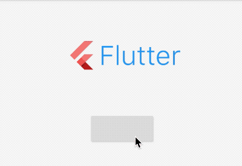

# FlutterLogo

FlutterLogo是一个显示Flutter Logo的控件，虽然FlutterLogo使用起来比较简单，但其实现并不简单，首先FlutterLogo是一个动画控件（AnimatedContainer实现），其次FlutterLogo是通过Painter绘制出来。


用法如下：

```dart
FlutterLogo(
  size: 60,
  colors: Colors.red,
)
```

效果如下：


显示Flutter文字标识，代码如下：

```dart
FlutterLogo(
  size: 160,
  colors: Colors.red,
  style: FlutterLogoStyle.horizontal,
  textColor: Colors.blue,
)
```

效果如下：


`style`属性有3个值：

-  markOnly：只显示logo
-  horizontal：flutter文字显示在logo右面
-  stacked：flutter文字显示在logo下面


设置动画：

```dart
var _style = FlutterLogoStyle.horizontal;

Column(
  children: <Widget>[
    FlutterLogo(
      size: 160,
      colors: Colors.red,
      style: _style,
      textColor: Colors.blue,
      duration: Duration(seconds: 1),
      curve: Curves.linear,
    ),
    RaisedButton(
      onPressed: (){
        setState(() {
          _style = FlutterLogoStyle.stacked;
        });
      },
    ),
  ],
)
```

效果如下：

