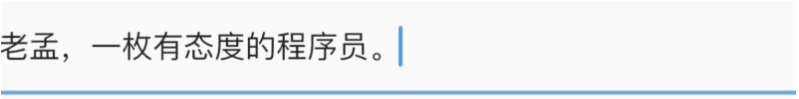
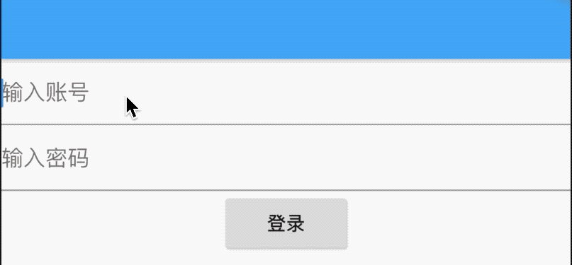
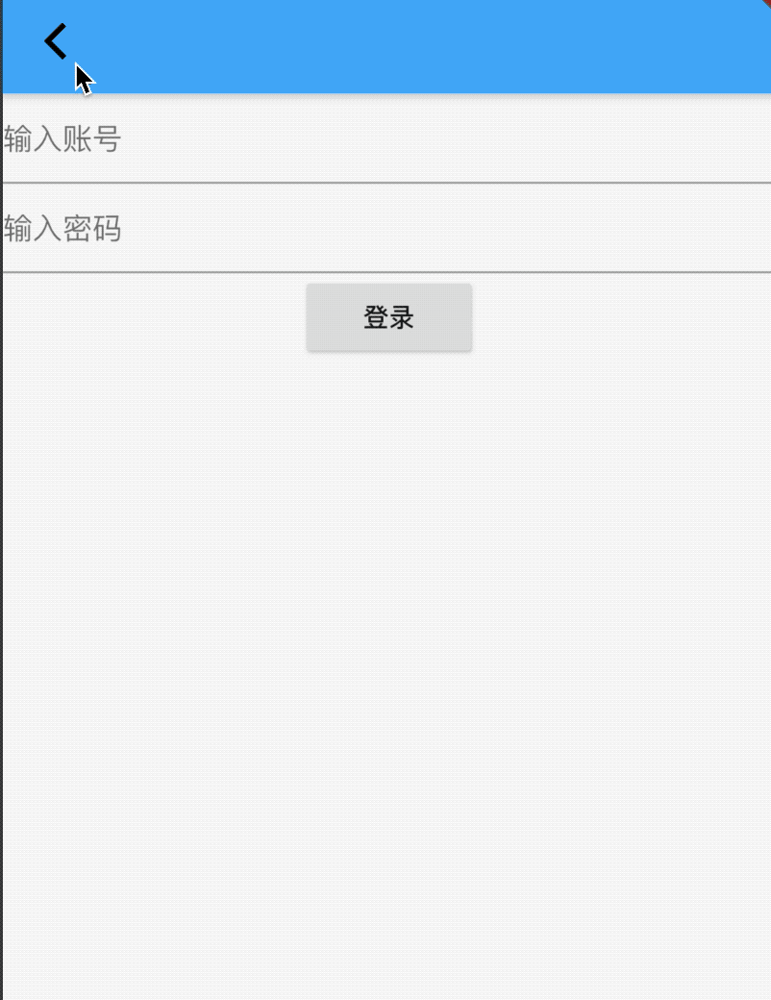

# Form

Form、FormField、TextFormField是表单相关控件，类似于H5中form。


## FormField

FormField是一个表单控件，此控件包含表单的状态，方便更新UI，通常情况下，我们不会直接使用FormField，而是使用TextFormField。

## TextFormField

TextFormField继承自FormField，是一个输入框表单，因此TextFormField中有很多关于TextField的属性，TextFormField的基本用法：

```dart
TextFormField(
  onSaved: (value){
    print('$value');
  },
  autovalidate: false,
  validator: (String value){
    return value.length>=6?null:'账号最少6个字符';
  },
)
```

TextFormField效果如下：



`onSaved`是一个可选参数，当Form调用FormState.save时才会回调此方法。

`autovalidate`参数为是否自动验证，设置为true时，TextField发生变化就会调用validator，设置false时，FormFieldState.validate调用时才会回调validator，如果Form的`autovalidate`设置为true，TextFormField忽略此参数。

`validator`验证函数，输入的值不匹配的时候返回的字符串显示在TextField的errorText属性位置，返回null，表示没有错误。


## Form

Form组件是一个容器类控件，可以包含多个FormField表单控件，这样的好处是统一管理。

在使用Form的时候需要设置其key，通过key获取当前的FormState，然后可以调用FormState的`save`、`validate`、`reset`等方法，一般通过如下方法设置：

```dart
final _formKey = GlobalKey<FormState>();
Form(
	key: _formKey,
	...
)
```

获取FormState并调用相关方法：

```dart
var _state = _formKey.currentState;
if(_state.validate()){
  _state.save();
}
```

`validate`方法为验证表单数据的合法性，此方法会调用每一个FormField的`validator`回调，此回调需要字符串表示数据验证不通过，将会在改表单下显示返回的字符串，具体可查看下TextFormField介绍。

`save`方法回调每一个FormField的save方法，通常情况下保存表单数据。

用Form写一个简单的登录功能，代码如下：

```dart
var _account = '';
var _pwd = '';
final _formKey = GlobalKey<FormState>();
Form(
  key: _formKey,
  child: Column(
    children: <Widget>[
      TextFormField(
        decoration: InputDecoration(hintText: '输入账号'),
        onSaved: (value) {
          _name = value;
        },
        validator: (String value) {
          return value.length >= 6 ? null : '账号最少6个字符';
        },
      ),
      TextFormField(
        decoration: InputDecoration(hintText: '输入密码'),
        obscureText: true,
        onSaved: (value) {
          _pwd = value;
        },
        validator: (String value) {
          return value.length >= 6 ? null : '账号最少6个字符';
        },
      ),
      RaisedButton(
        child: Text('登录'),
        onPressed: () {
          var _state = Form.of(context);
          if(_state.validate()){
            _state.save();
            login(_name,_pwd);
          }
        },
      )
    ],
  ),
)
```



我们希望用户在输入表单时点击返回按钮提示用户"确认退出吗？"，用法如下：

```dart
Form(
  key: _formKey,
  onWillPop: () async {
    return await showDialog<bool>(
        context: context,
        builder: (BuildContext context) {
          return AlertDialog(
            title: Text('提示'),
            content: Text('确认退出吗？'),
            actions: <Widget>[
              FlatButton(
                child: Text('取消'),
                onPressed: () {
                  Navigator.of(context).pop(false);
                },
              ),
              FlatButton(
                child: Text('确认'),
                onPressed: () {
                  Navigator.of(context).pop(true);
                },
              ),
            ],
          );
        });
  },
  ...
)
```

效果如下：



`onWillPop`回调决定`Form`所在的路由是否可以直接返回，该回调需要返回`Future<bool>`，返回`false`表示当前路由不会返回；为`true`，则会返回到上一个路由。此属性通常用于拦截返回按钮。

`onChanged`：当子表单控件发生变化时回调。

