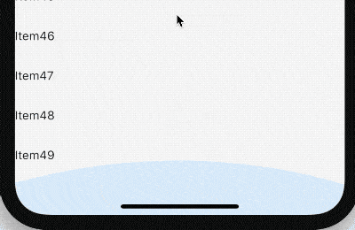

# GlowingOverscrollIndicator

GlowingOverscrollIndicator 是Android平台ListView列表滑动到底部时在滑动出现的水波纹效果，此控件配合ScrollNotification使用。

案例：在IOS平台上也使用此效果

```dart
ScrollConfiguration(
  behavior: MyScrollBehavior(),
  child: ListView.builder(
    shrinkWrap: true,
    itemBuilder: (BuildContext context, int index) {
      return Text('Item$index');
    },
    itemExtent: 50,
    itemCount: 50,
  ),
)
```

MyScrollBehavior定义如下：

```dart
class MyScrollBehavior extends ScrollBehavior {
  @override
  Widget buildViewportChrome(
      BuildContext context, Widget child, AxisDirection axisDirection) {
    return GlowingOverscrollIndicator(
      child: child,
      axisDirection: axisDirection,
      color: Colors.blue,
    );
  }

  @override
  ScrollPhysics getScrollPhysics(BuildContext context) {
    return ClampingScrollPhysics();
  }
}
```



