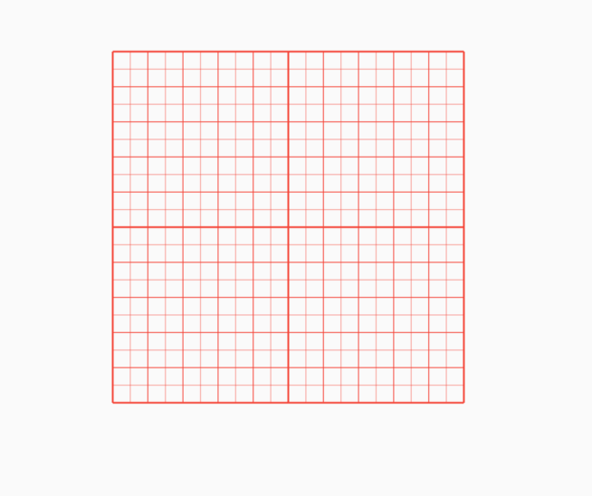
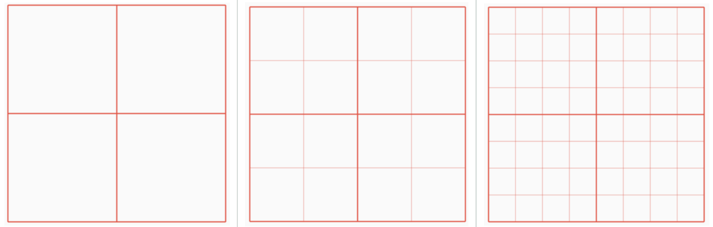
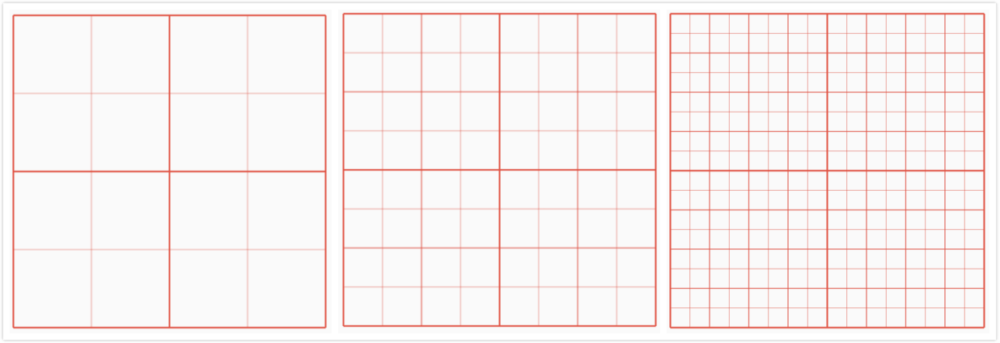

## GridPaper

绘制一个像素宽度的直线网格，用法如下：

```dart
GridPaper(
	color: Colors.red,
)
```

效果如下：



`interval`参数表示2条线之间的间隔，默认是100逻辑像素，注意单位是逻辑像素，而不是物理像素。

`divisions`参数表示每个主网格的分割数。

`subdivisions`参数表示次网格的分割数，包含它自身。

设置200x200的区域，绘制网格，`divisions`和`subdivisions`都为1，代码如下：

```dart
Container(
  height: 200,
  width: 200,
  child: GridPaper(
    color: Colors.red,
    divisions: 1,
    subdivisions: 1,
  ),
)
```

`divisions`设置为1、2、4效果如下：



将`divisions`为2，`subdivisions`设置为1、2、4效果如下：



