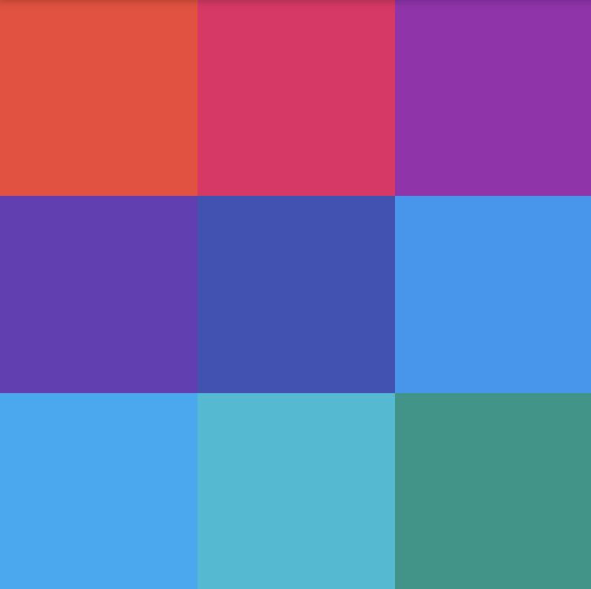
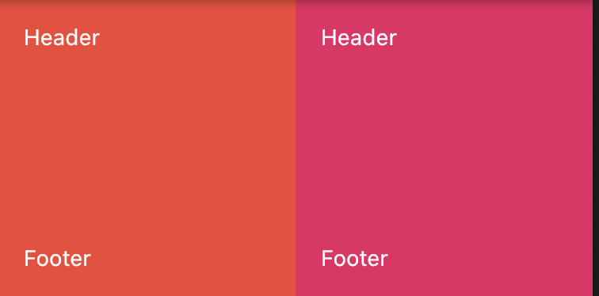
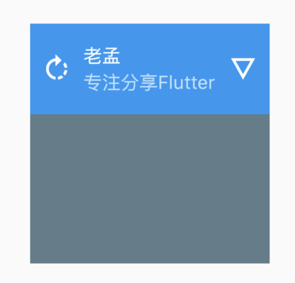

# GridTile
继承关系
 Object>Diagnosticable>DiagnosticableTree>Widget>StatelessWidget>GridTile


GridTile通常作为GridView的子控件，用法如下：

```dart
GridView.builder(
  gridDelegate: SliverGridDelegateWithFixedCrossAxisCount(
    crossAxisCount: 3,
  ),
  itemBuilder: (context, index) {
    return GridTile(
      child: Container(
        height: 80,
        color: Colors.primaries[index % Colors.primaries.length],
      ),
    );
  },
  itemCount: 50,
)
```

效果如下：



增加`header`和`footer`，一般情况下`header`和`footer`使用GridTileBar控件，用法如下：

```dart
GridTile(
  header: GridTileBar(title: Text('Header'),),
  child: Container(
    height: 80,
    color: Colors.primaries[index % Colors.primaries.length],
  ),
  footer: GridTileBar(title: Text('Footer'),),
)
```

效果如下：




通过代码和图可以看到GridTile有如下几个特点：

- 页眉、页脚在视图顶层，覆盖在child之上
- child组件高度设置无效，这个源码里可以看到原因
- 继承自StatelessWidget，一旦创建，不可变。

## GridTileBar

GridTileBar用于[GridTile](http://laomengit.com/flutter/widgets/GridTile.html) 组件中，做为header或者footer。

用法如下：

```dart
GridTile(
  header: GridTileBar(
    title: Text('老孟'),
    subtitle: Text('专注分享Flutter'),
    backgroundColor: Colors.blue,
    leading: Icon(Icons.rotate_right),
    trailing: Icon(Icons.details),
  ),
  child: Container(
    color: Colors.blueGrey,
  ),
)
```

`leading` 和`trailing`分别代表前置图标和后置图标，效果如下：



# 源码分析

```
 @override
  Widget build(BuildContext context) {
    if (header == null && footer == null)
      return child;

    return Stack(
      children: <Widget>[
        Positioned.fill(
          child: child,
        ),
        if (header != null)
          Positioned(
            top: 0.0,
            left: 0.0,
            right: 0.0,
            child: header,
          ),
        if (footer != null)
          Positioned(
            left: 0.0,
            bottom: 0.0,
            right: 0.0,
            child: footer,
          ),
      ],
    );
  }
```
- Stack 创建一个堆结构视图
- header 、footer都为null时直接返回child
- Positioned.fill 让child充满父组件
- Positioned(top: 0.0,left: 0.0,right: 0.0,child: header,) header放顶部显示
- Positioned(left: 0.0,bottom: 0.0,right: 0.0,child: footer,) footer放底部显示

# 总结
GridTile适合做带有页眉页脚的页面样式，但有一点child 顶部和底部会被页眉页脚覆盖，用的时候需要注意。


本文由[ **i校长**](https://www.jianshu.com/u/77699cd41b28)和[**K423-D**](https://github.com/K423-D)提供。


