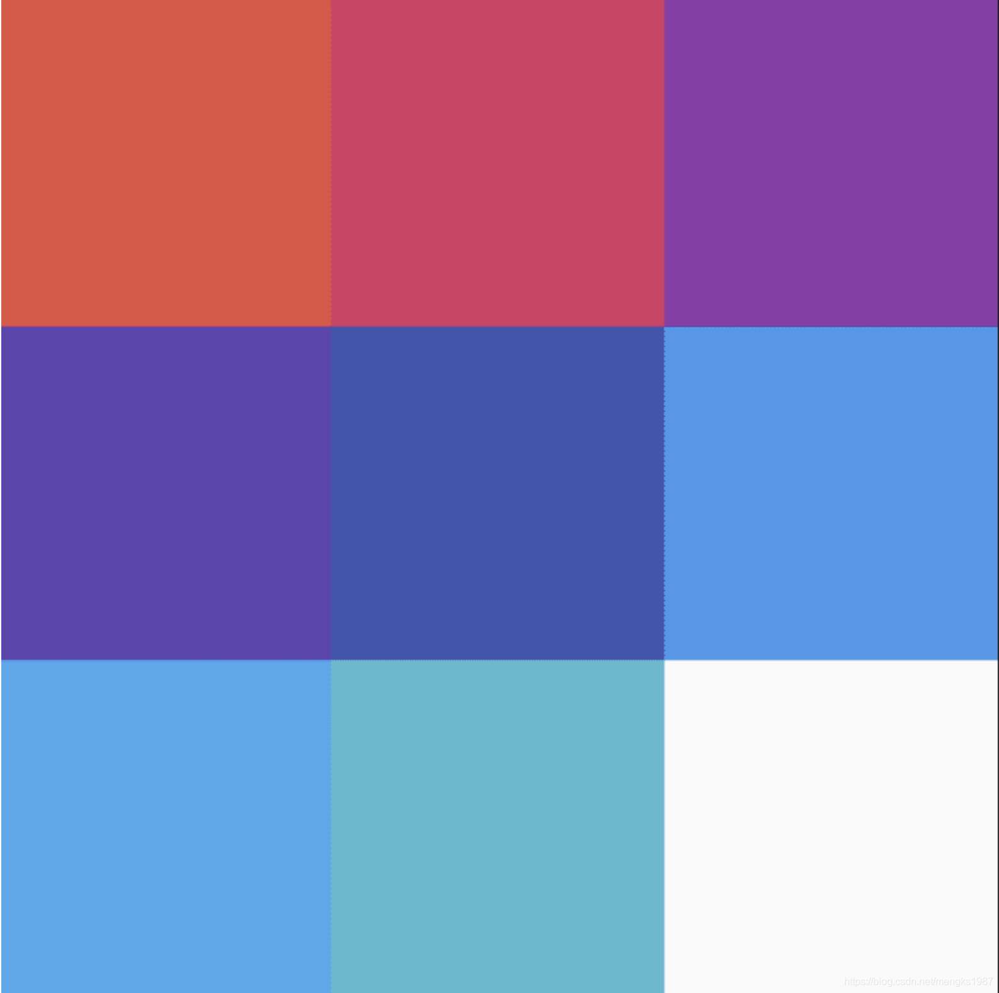
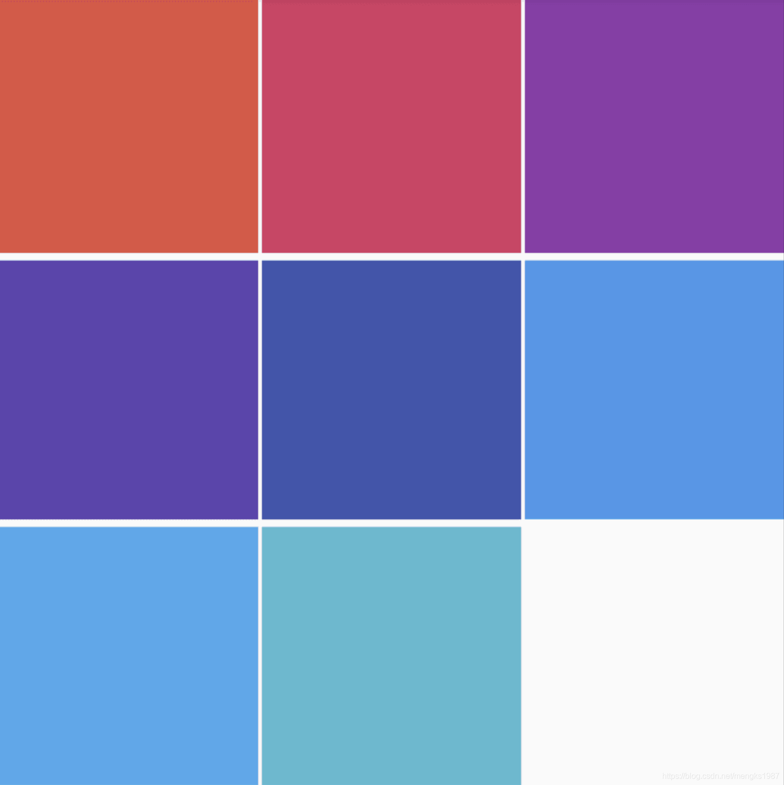

# GridView

GridView是一个可滚动的，2D数组控件。

基本用法如下：

```dart
GridView(
  gridDelegate: SliverGridDelegateWithFixedCrossAxisCount(
    crossAxisCount: 3,
  ),
  children: [
    _createGridViewItem(Colors.primaries[0]),
    _createGridViewItem(Colors.primaries[1]),
    _createGridViewItem(Colors.primaries[2]),
    _createGridViewItem(Colors.primaries[3]),
    _createGridViewItem(Colors.primaries[4]),
    _createGridViewItem(Colors.primaries[5]),
    _createGridViewItem(Colors.primaries[6]),
    _createGridViewItem(Colors.primaries[7]),

  ],
)
_createGridViewItem(Color color){
    return Container(
      height: 80,
      color: color,
    );
  }
```

效果如下：



`gridDelegate`参数控制子控件的排列，有2个选择：

-  SliverGridDelegateWithFixedCrossAxisCount：交叉轴方向上固定数量，对于垂直方向的GridView来说交叉轴方向指的是水平方向。
- SliverGridDelegateWithMaxCrossAxisExtent：交叉轴方向上尽量大，比如水平方上有500空间，指定此值为150，那么可以放3个，剩余一些空间，此时GridView将会缩小每一个Item，放置4个。

SliverGridDelegateWithFixedCrossAxisCount有属性介绍如下：

- `crossAxisCount`：交叉轴方向上个数。
- `mainAxisSpacing`：主轴方向上2行之间的间隔。
- `crossAxisSpacing`：交叉轴方向上之间的间隔。
- `childAspectRatio`：子控件宽高比。

设置间隔如下：

```dart
GridView(
  gridDelegate: SliverGridDelegateWithFixedCrossAxisCount(
    crossAxisCount: 3,
    crossAxisSpacing: 2,
    mainAxisSpacing: 4
  )
  ...
)
```

效果如下：



scrollDirection`表示滚动方向，默认是垂直方向，可以设置为水平方向。

`reverse`表示是否反转滚动方向，比如当前滚动方向是垂直方向，`reverse`设置为true，滚动方向为从上倒下，设置为false，滚动方向为从下倒上。

用法如下：

```dart
GridView(
  scrollDirection: Axis.horizontal,
  reverse: true,
  ...
)
```

`controller`表示滚动相关，可以通过ScrollController获取到当前滚动位置，或者指定滚动到某一位置，用法如下：

```dart
ScrollController _gridViewController;

@override
  void initState() {
    _gridViewController = ScrollController()..addListener(() {
      print('${_gridViewController.position}');
    });
  }
  
GridView(
  controller: _gridViewController,
	...
)
```

`physics`参数控制滚动到物理特性，比如设置为不可滚动：

```dart
GridView(
    physics: NeverScrollableScrollPhysics(),
  ···
)
```

系统提供的ScrollPhysics有：

- AlwaysScrollableScrollPhysics：总是可以滑动
- NeverScrollableScrollPhysics：禁止滚动
- BouncingScrollPhysics ：内容超过一屏 上拉有回弹效果
- ClampingScrollPhysics ：包裹内容 不会有回弹


直接使用最开始的方法创建GridView是不推荐的，此方法不适合加载大量数据的情况，GridView提供了一些快速构建的方法，比如builder，用法如下：

```dart
GridView.builder(
  gridDelegate: SliverGridDelegateWithFixedCrossAxisCount(
    crossAxisCount: 3,
  ),
  itemBuilder: (context, index) {
    return Container(
      height: 80,
      color: Colors.primaries[index % Colors.primaries.length],
    );
  },
  itemCount: 50,
)
```

`itemBuilder`是构建子控件，`itemCount`指定数据个数。

使用`GridView.custom`构建：

```dart
GridView.custom(
  gridDelegate: SliverGridDelegateWithFixedCrossAxisCount(
    crossAxisCount: 3,
  ),
  childrenDelegate: SliverChildBuilderDelegate((context, index) {
    return Container(
        height: 80,
        color: Colors.primaries[index % Colors.primaries.length]);
  }, childCount: 50),
)
```

使用`GridView.count`构建：

```dart
GridView.count(
  crossAxisCount: 3,
  children: List.generate(50, (i) {
    return Container(
      height: 80,
      color: Colors.primaries[i % Colors.primaries.length],
    );
  }),
)
```

使用`GridView.extent`构建：

```dart
GridView.extent(
  maxCrossAxisExtent: 100,
  children: List.generate(50, (i) {
    return Container(
      height: 80,
      color: Colors.primaries[i % Colors.primaries.length],
    );
  }),
)
```

