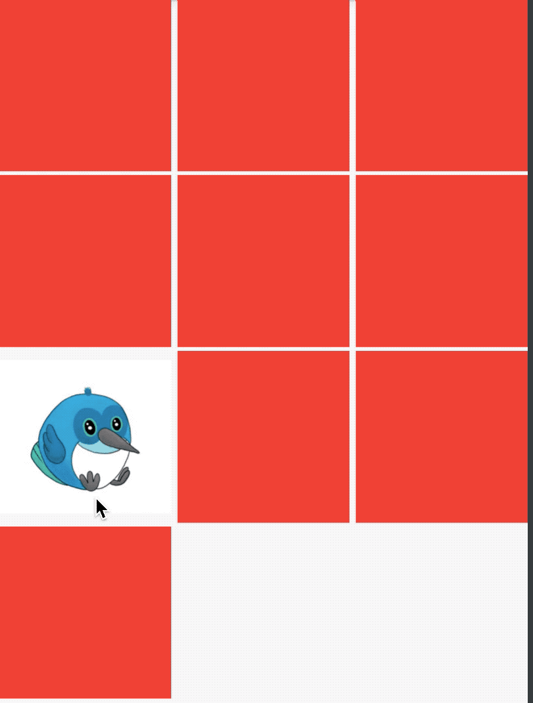

# Hero

Hero是我们常用的过渡动画，当用户点击一张图片，切换到另一个页面时，这个页面也有此图，那么使用Hero组件就在合适不过了，先看下Hero的效果图：



上面效果实现的列表页面代码如下：

```dart
class HeroDemo extends StatefulWidget {
  @override
  State<StatefulWidget> createState() => _HeroDemo();
}

class _HeroDemo extends State<HeroDemo> {
  @override
  Widget build(BuildContext context) {
    return Scaffold(
      body: GridView(
        gridDelegate: SliverGridDelegateWithFixedCrossAxisCount(
            crossAxisCount: 3, crossAxisSpacing: 5, mainAxisSpacing: 3),
        children: List.generate(10, (index) {
          if (index == 6) {
            return InkWell(
              onTap: () {
                Navigator.push(
                    context,
                    new MaterialPageRoute(
                        builder: (context) => new _Hero1Demo()));
              },
              child: Hero(
                tag: 'hero',
                child: Container(
                  child: Image.asset(
                    'images/bird.png',
                    fit: BoxFit.fitWidth,
                  ),
                ),
              ),
            );
          }
          return Container(
            color: Colors.red,
          );
        }),
      ),
    );
  }
}
```

第二个页面代码如下：

```dart
class _Hero1Demo extends StatelessWidget {
  @override
  Widget build(BuildContext context) {
    return Scaffold(
      appBar: AppBar(),
      body: Container(
          alignment: Alignment.topCenter,
          child: Hero(
            tag: 'hero',
            child: Container(
              child: Image.asset(
                'images/bird.png',
              ),
            ),
          )),
    );
  }
}
```

2个页面都有Hero控件，且`tag`参数一致。

