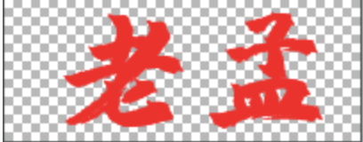
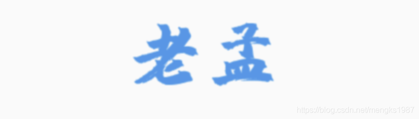

## Icon

Icon是图标控件，Icon不具有交互属性，如果想要交互，可以使用IconButton，另外Icon是具有方向性（Directionality）的，但通常情况下不会在Icon中设置`textDirection`，而是使用顶级控件中的设置。

使用图标需要在`pubspec.yaml`中进行设置：

```dart
flutter:
  uses-material-design: true
```

创建Flutter项目的时候默认配置了此项，所以正常情况下不需要关注。

基本用法：

```dart
Icon(Icons.add)
```

系统提供的图标都在Icons中，效果如下：


到官网查看所有图标：[https://api.flutter.dev/flutter/material/Icons-class.html](https://api.flutter.dev/flutter/material/Icons-class.html)

所有图标一览：


推荐一些图标库：

- [https://github.com/google/fonts](https://github.com/google/fonts)
- [https://fonts.google.com](https://fonts.google.com)
- [https://www.iconfont.cn](https://www.iconfont.cn)

建议大家多使用图标，不仅包体会小很多，而且图标都是矢量的，不存在失真的问题。


设置其大小和颜色：

```dart
Icon(
  Icons.add,
  size: 28,
  color: Colors.red,
)
```

效果如下：


## AssetImage

AssetImage控件是根据图片绘制图标，就是图片上的透明通道不绘制，而不透明的地方使用设置的颜色绘制，

比如下面这张原图



除了字体外，其他地方是透明的，将字体显示为蓝色：

```dart
ImageIcon(
  AssetImage('images/name1.png'),
  size: 100,
  color: Colors.blue,
)
```

效果如下：



这里说下`image`参数，它接收的类型是`ImageProvider`，平时使用的`Image.asset`、`Image.memory`等不是此类型，需要使用AssetImage、MemoryImage等。

