图片组件是Flutter基础组件之一，和文本组件一样必不可少。图片组件包含Image和Icon两个组件，本质上Icon不属于图片组件，但其外形效果上类似于图片。

在项目中建议优先使用Icon组件，Icon本质上是一种字体，只不过显示的不是**文字**，而是图标，而Image组件先通过图片解码器将图片解码，所以Icon有如下优点：

- 通常情况下，图标比图片体积更小，显著的减少App包体积。
- 图标不会出现失真或者模糊的现象，例如将20x20的图片，渲染在200x200的屏幕上，图片会失真或模糊，而图标是矢量图，不会失真，就像字体一样。
- 多个图标可以存放在一个文件中，方便管理。
- 全平台通用。


### Image

Image组件用于显示图片，图片的来源可以是网络、项目中图片或者设备上的图片。

加载网络图片：

```dart
Image.network(
  'http://pic1.win4000.com/pic/c/cf/cdc983699c.jpg',
)
```

加载项目中图片：

首先将图片拷贝到项目中，通常情况下，拷贝到`assets/images/`目录下，`assets/images/`目录为手动创建，新建的项目默认是没有此目录的。

设置`pubspec.yaml`配置文件：

```dart
assets:
  - assets/images/
```

或者指定具体图片的名称：

```dart
assets:
  - assets/images/aa.jpg
```

通常情况下，使用第一种方式，因为图片会有很多张，增加一张就这里配置一个太麻烦。


**注意：assets前面的空格问题，极容易引发编译异常，正确格式如下：**

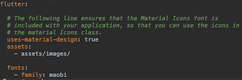

加载图片：

```dart
Image.asset('assets/images/aa.jpg')
```


加载设备上的图片：

要加载设备（手机）上的图片首先需要获取设备图片的路径，由于不同平台的路径不同，因此路径的获取必须依靠原生支持，如果了解原生（Android和iOS）开发，可以直接使用**MethodChannel**获取路径，如果不懂原生（Android和iOS）开发，可以使用第三方插件获取路径，这里推荐**官方的[path_provider](https://pub.flutter-io.cn/packages/path_provider)**。

加载设备上的图片:

```dart
Image.file(File('path'))
```


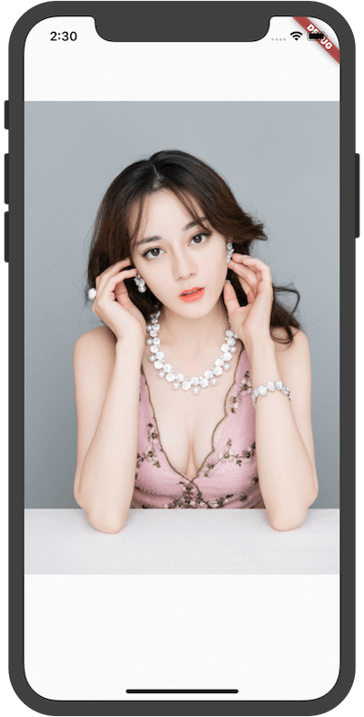


设置图片的大小：

```dart
Image.asset('assets/images/aa.jpg',width: 100,height: 200,),
```

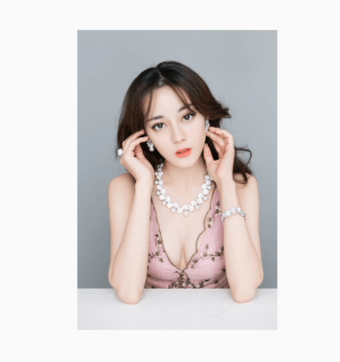

当Image的大小和图片大小不匹配时，需要设置填充模式`fit`，设置组件大小为150x150，

```dart
Container(
  color: Colors.red.withOpacity(.3),
  child: Image.asset('assets/images/aa.jpg',width: 150,height: 150),
)
```


看到，图片左右两边有空白区域（浅红色填充的区域），如果想要图片充满整个区域，设置如下：

```dart
Container(
  color: Colors.red.withOpacity(.3),
  child: Image.asset('assets/images/aa.jpg',width: 150,height: 150,fit: BoxFit.fill,),
)
```

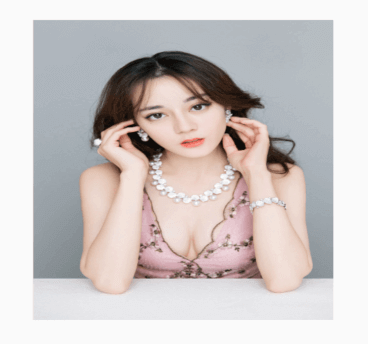

虽然图片充满整个区域，但图片变形了，使图片等比拉伸，直到两边都充满区域：

```dart
Container(
  color: Colors.red.withOpacity(.3),
  child: Image.asset('assets/images/aa.jpg',width: 150,height: 150,fit: BoxFit.cover,),
)
```

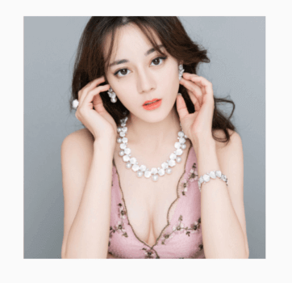

此时，图片未变形且两边都充满区域，不过图片被裁减了一部分。

`fit`参数就是设置填充方式，其值介绍如下：

- fill：完全填充，宽高比可能会变。
- contain：等比拉伸，直到一边填充满。
- cover：等比拉伸，直到2边都填充满，此时一边可能超出范围。
- fitWidth：等比拉伸，宽填充满。
- fitHeight：等比拉伸，高填充满。
- none：当组件比图片小时，不拉伸，超出范围截取。
- scaleDown：当组件比图片小时，图片等比缩小，效果和**contain**一样。

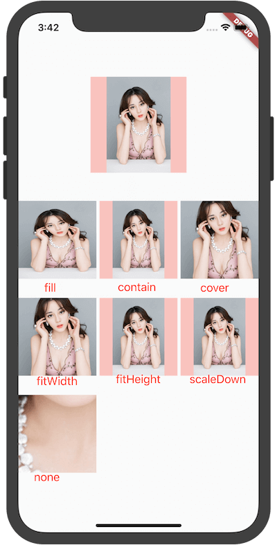

`BoxFit.none`的裁减和`alignment`相关，默认居中，

```dart
Image.asset(
  'assets/images/aa.jpg',
  width: 150,
  height: 150,
  fit: BoxFit.none,
  alignment: Alignment.centerRight,
),
```

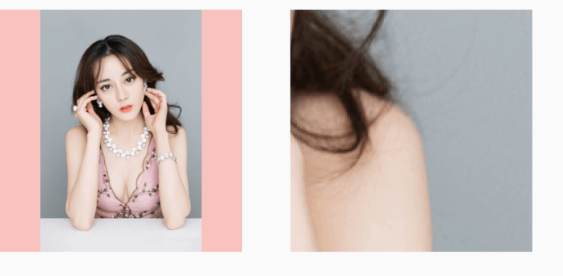

左边为原图。

设置对齐方式：

```dart
Container(
  color: Colors.red.withOpacity(.3),
  child: Image.asset(
    'assets/images/aa.jpg',
    width: 150,
    height: 150,
    alignment: Alignment.centerLeft,
  ),
),
```

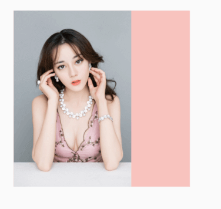

`color`和`colorBlendMode`用于将颜色和图片进行颜色混合，`colorBlendMode`表示混合模式，下面介绍的混合模式比较多，浏览一遍即可，此属性可以用于简单的滤镜效果。

- clear：清楚源图像和目标图像。
- color：获取源图像的色相和饱和度以及目标图像的光度。
- colorBurn：将目标的倒数除以源，然后将结果倒数。
- colorDodge：将目标除以源的倒数。
- darken：通过从每个颜色通道中选择最小值来合成源图像和目标图像。
- difference：从每个通道的较大值中减去较小的值。合成黑色没有效果。合成白色会使另一张图像的颜色反转。
- dst：仅绘制目标图像。
- dstATop：将目标图像合成到源图像上，但仅在与源图像重叠的位置合成。
- dstIn：显示目标图像，但仅显示两个图像重叠的位置。不渲染源图像，仅将其视为蒙版。源的颜色通道将被忽略，只有不透明度才起作用。
- dstOut：显示目标图像，但仅显示两个图像不重叠的位置。不渲染源图像，仅将其视为蒙版。源的颜色通道将被忽略，只有不透明度才起作用。
- dstOver：将源图像合成到目标图像下。
- exclusion：从两个图像的总和中减去两个图像的乘积的两倍。
- hardLight：调整源图像和目标图像的成分以使其适合源图像之后，将它们相乘。
- hue：获取源图像的色相，以及目标图像的饱和度和光度。
- lighten：通过从每个颜色通道中选择最大值来合成源图像和目标图像。
- luminosity：获取源图像的亮度，以及目标图像的色相和饱和度。
- modulate：将源图像和目标图像的颜色分量相乘。
- multiply：将源图像和目标图像的分量相乘，包括alpha通道。
- overlay：调整源图像和目标图像的分量以使其适合目标后，将它们相乘。
- plus：对源图像和目标图像的组成部分求和。
- saturation：获取源图像的饱和度以及目标图像的色相和亮度。
- screen：将源图像和目标图像的分量的逆值相乘，然后对结果求逆。
- softLight：对于低于0.5的源值使用colorDodge，对于高于0.5的源值使用colorBurn。
- src：放置目标图像，仅绘制源图像。
- srcATop：将源图像合成到目标图像上，但仅在与目标图像重叠的位置合成。
- srcIn：显示源图像，但仅显示两个图像重叠的位置。目标图像未渲染，仅被视为蒙版。目标的颜色通道将被忽略，只有不透明度才起作用。
- srcOut：显示源图像，但仅显示两个图像不重叠的位置。
- srcOver：将源图像合成到目标图像上。
- xor：将按位异或运算符应用于源图像和目标图像。


**是不是感觉看了和没看差不多，看了也看不懂。**正常，估计只有学过视觉算法的才能看懂吧，直接看下各个属性的效果吧：


`repeat`表示当组件有空余位置时，将会重复显示图片

```dart
Image.asset(
  'assets/images/aa.jpg',
  width: double.infinity,
  height: 150,
  repeat: ImageRepeat.repeatX,
)
```


重复的模式有：

-  repeat：x,y方向都充满。
-  repeatX：x方向充满。
- repeatY：y方向充满。
-  noRepeat：不重复。


`matchTextDirection`设置为true时，图片的绘制方向为**TextDirection**设置的方向，其父组件必须为**Directionality**：

```dart
Directionality(
    textDirection: TextDirection.rtl,
    child: Image.asset(
      'assets/images/logo.png',
      height: 150,
      matchTextDirection: true,
    )),
```

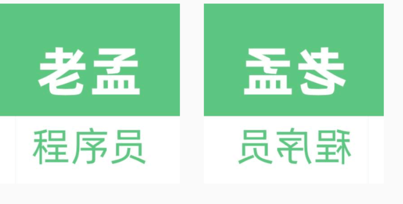

左边为原图，效果是左右镜像。


`filterQuality`表示绘制图像的质量，从高到低为：high->medium->low->none。越高效果越好，越平滑，当然性能损耗越大，默认是`low`，如果发现图片有锯齿，可以设置此参数。


当加载图片的时候回调`frameBuilder`，当此参数为null时，此控件将会在图片加载完成后显示，未加载完成时显示空白，尤其在加载网络图片时会更明显。因此此参数可以用于处理图片加载时显示占位图片和加载图片的过渡效果，比如淡入淡出效果。

下面的案例是淡入淡出效果：

```dart
Image.network(
  'https://flutter.github.io/assets-for-api-docs/assets/widgets/puffin.jpg',
  frameBuilder: (BuildContext context, Widget child, int frame,
      bool wasSynchronouslyLoaded) {
    if (wasSynchronouslyLoaded) {
      return child;
    }
    return AnimatedOpacity(
      child: child,
      opacity: frame == null ? 0 : 1,
      duration: const Duration(seconds: 2),
      curve: Curves.easeOut,
    );
  },
)
```

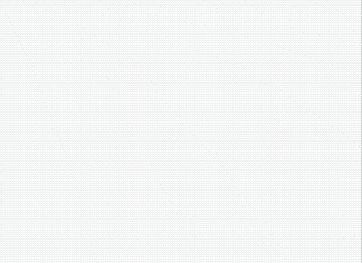

`loadingBuilder`参数比`frameBuilder`控制的力度更细，可以获取图片加载的进度，下面的案例显示了加载进度条：

```dart
Image.network(
    'https://flutter.github.io/assets-for-api-docs/assets/widgets/puffin.jpg',
    loadingBuilder: (BuildContext context, Widget child,
        ImageChunkEvent loadingProgress) {
  if (loadingProgress == null) {
    return child;
  }
  return Center(
    child: CircularProgressIndicator(
      value: loadingProgress.expectedTotalBytes != null
          ? loadingProgress.cumulativeBytesLoaded /
              loadingProgress.expectedTotalBytes
          : null,
    ),
  );
})
```

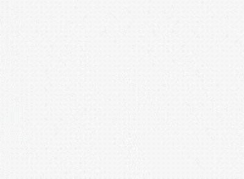


`centerSlice`用于.9图，.9图用于拉伸图片的特定区域，`centerSlice`设置的区域（Rect）就是拉伸的区域。.9图通常用于控件大小、宽高比不固定的场景，比如**聊天背景图片**等。

```dart
Container(
    width: 250,
    height: 300,
    decoration: BoxDecoration(
        image: DecorationImage(
            centerSlice: Rect.fromLTWH(20, 20, 10, 10),
            image: AssetImage(
              'assets/images/abc.jpg',
            ),
            fit: BoxFit.fill))),
```

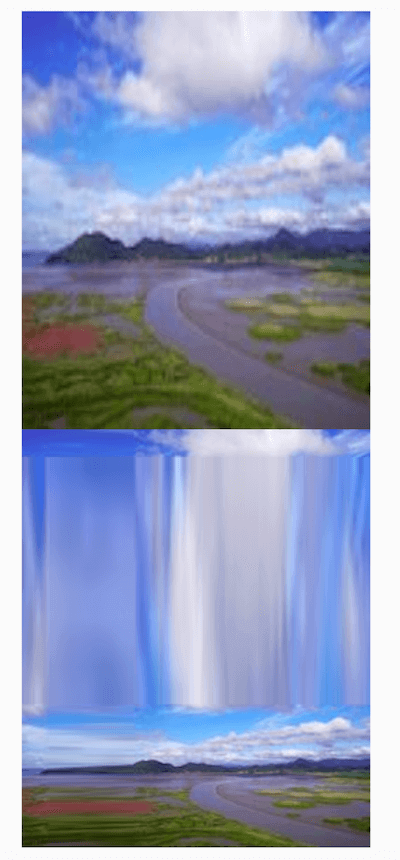

上面为原图，下面为拉伸的图片。

在使用时大概率会出现如下异常：

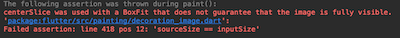

这是由于图片比组件的尺寸大，如果使用`centerSlice`属性，图片必须比组件的尺寸小，一般情况下，.9图的尺寸都非常小。

### Icon

Icon是图标组件，Icon不具有交互属性，如果想要交互，可以使用IconButton。

```dart
Icon(Icons.add),
```

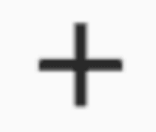


设置图标的大小和颜色：

```dart
Icon(
  Icons.add,
  size: 40,
  color: Colors.red,
)
```

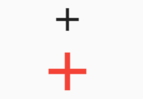

上面的黑色为默认大小和颜色。


`Icons.add`是系统提供的图标，创建Flutter项目的时候，`pubspec.yaml`中默认有如下配置：

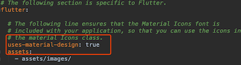

所有的图标在**Icons**中已经定义，可以直接在源代码中查看，也可以到[官网查看所有图标](https://api.flutter.dev/flutter/material/Icons-class.html)。

所有图标效果如下：


