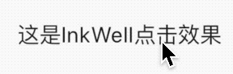
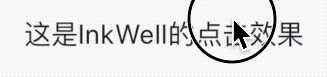
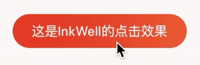

## InkWell

InkWell组件在用户点击时出现“水波纹”效果，InkWell简单用法：
```
InkWell(
        onTap: (){},
        child: Text('这是InkWell点击效果'),
      )
```
`onTap`是点击事件回调，如果不设置无法出现“水波纹”效果，效果如下：




设置水波纹颜色：

```
InkWell(
	onTap: () {},
	splashColor: Colors.red,
	...
)
```
效果如下：


设置高亮颜色颜色：

```
InkWell(
	onTap: () {},
	highlightColor: Colors.blue,
	...
)
```
高亮颜色是按住时显示的颜色，效果如下：



给字体添加边距和圆角边框，扩大“水波纹”效果：

```
InkWell(
        onTap: (){},
        child: Container(
          padding: EdgeInsets.symmetric(horizontal: 20,vertical: 8),
          decoration: BoxDecoration(
            border:Border.all(color: Colors.blue),
            borderRadius: BorderRadius.all(Radius.circular(30))
                
          ),
          child: Text('这是InkWell点击效果'),
        ),
      )
```
效果如下：


发现“水波纹”超出的了圆角边框，如何解决这个问题呢？Ink隆重登场。

## Ink

Ink的官方解释：
> A convenience widget for drawing images and other decorations on [Material] widgets, so that [InkWell] and [InkResponse] splashes will render over them.

简单翻译：Ink控件用于在[Material]控件上绘制图像和其他装饰，以便[InkWell]、[InkResponse]控件的“水波纹”效果在其上面显示。

上面的问题修改代码如下：
```
Ink(
        decoration: BoxDecoration(
            gradient: LinearGradient(
                begin: Alignment.topLeft,
                end: Alignment.bottomRight,
                colors: [Color(0xFFDE2F21), Color(0xFFEC592F)]),
            borderRadius: BorderRadius.all(Radius.circular(20))),
        child: InkWell(
          borderRadius: BorderRadius.all(Radius.circular(20)),
          child: Container(
            padding: EdgeInsets.symmetric(vertical: 8, horizontal: 20),
            child: Text(
              '这是InkWell的点击效果',
              style: TextStyle(color: Colors.white),
            ),
          ),
          onTap: () {},
        ),
      )
```
效果如下：




