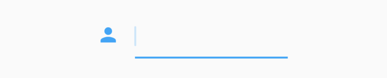
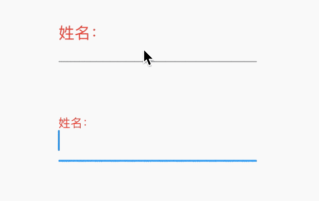
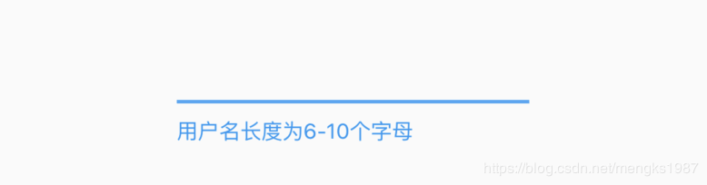
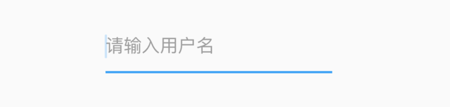
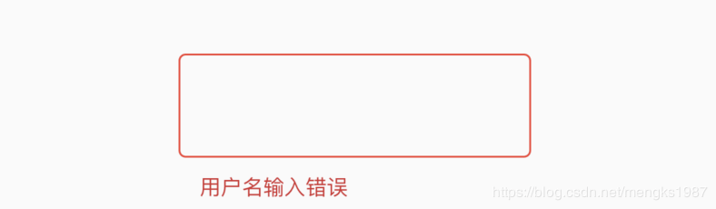
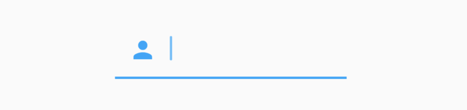
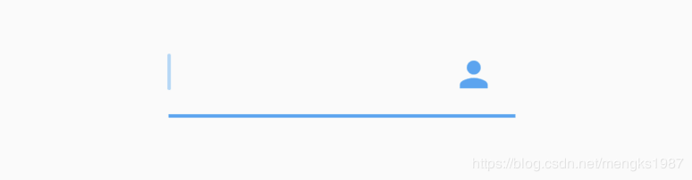
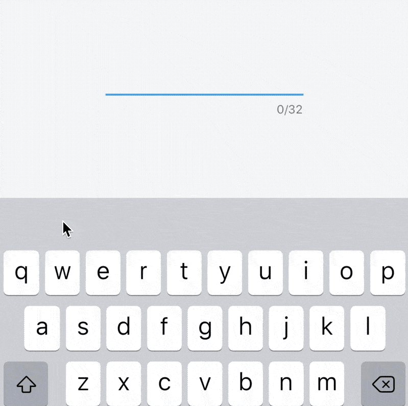
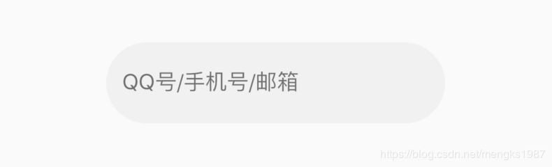

# InputDecoration

InputDecoration 并不是一个控件，而是一个装饰类，用于装饰Material 风格的**TextField**组件的边框，标签，图标和样式。

#### icon

显示在输入框的前面，用法如下：

```dart
TextField(
  decoration: InputDecoration(
    icon: Icon(Icons.person),
  ),
)
```

效果如下：



####  labelText labelStyle hasFloatingPlaceholder

 当输入框是空而且没有焦点时，labelText显示在输入框上边，当获取焦点或者不为空时labelText往上移动一点，`labelStyle`参数表示文本样式，具体参考`TextStyle`， 用法如下：

```dart
TextField(
  decoration: InputDecoration(
    labelText: '姓名：',
    labelStyle: TextStyle(color:Colors.red)
  ),
)
```

效果如下：



`hasFloatingPlaceholder`参数控制当输入框获取焦点或者不为空时是否还显示`labelText`，默认为true，显示。

#### helperText helperStyle helperMaxLines

helperText显示在输入框的左下部，用于提示用户，`helperStyle`参数表示文本样式，具体参考`TextStyle`用法如下：

```dart
TextField(
  decoration: InputDecoration(
    helperText: '用户名长度为6-10个字母',
    helperStyle: TextStyle(color: Colors.blue),
    helperMaxLines: 1
  ),
)
```

效果如下：



#### hintText hintStyle hintMaxLines

hintText是当输入框为空时的提示，不为空时不在显示，用法如下：

```dart
TextField(
  decoration: InputDecoration(
    hintText: '请输入用户名',
    hintStyle: TextStyle(color: Colors.grey),
    hintMaxLines: 1
  ),
)
```



#### errorText errorStyle errorMaxLines errorBorder

errorText显示在输入框的左下部，默认字体为红色，用法如下：

```dart
TextField(
  decoration: InputDecoration(
    errorText: '用户名输入错误',
    errorStyle: TextStyle(fontSize: 12),
    errorMaxLines: 1,
    errorBorder: OutlineInputBorder(borderSide: BorderSide(color: Colors.red)),
  ),
)
```

效果如下：




#### prefixIcon prefix prefixText prefixStyle 

prefix系列的组件是输入框前面的部分，用法如下：

```dart
TextField(
  decoration: InputDecoration(
    prefixIcon: Icon(Icons.person)
  ),
)
```

注意prefix和icon的区别，icon是在输入框边框的外部，而prefix在里面，效果如下：



#### suffix suffixIcon suffixText suffixStyle

suffix和prefix相反，suffix在输入框的尾部，用法如下：

```dart
TextField(
  decoration: InputDecoration(
      suffixIcon: Icon(Icons.person)
  ),
)
```

效果：




#### counter counterText counterStyle

counter组件统计输入框文字的个数，counter仅仅是展示效果，不具备自动统计字数的功能， 自动统计字数代码如下：

```dart
var _textFieldValue = '';
TextField(
  onChanged: (value){
    setState(() {
      _textFieldValue = value;
    });
  },
  decoration: InputDecoration(
    counterText: '${_textFieldValue.length}/32'
  ),
)
```


效果如下：




#### filled fillColor focusedBorder disabledBorder

`filled`为true时，输入框将会被`fillColor`填充，仿QQ登录输入框代码如下：

```dart
Container(
  height: 60,
  width: 250,
  child: TextField(
    decoration: InputDecoration(
      fillColor: Color(0x30cccccc),
      filled: true,
      enabledBorder: OutlineInputBorder(
          borderSide: BorderSide(color: Color(0x00FF0000)),
          borderRadius: BorderRadius.all(Radius.circular(100))),
      hintText: 'QQ号/手机号/邮箱',
      focusedBorder: OutlineInputBorder(
          borderSide: BorderSide(color: Color(0x00000000)),
          borderRadius: BorderRadius.all(Radius.circular(100))),
    ),
  ),
)
```

效果如下：




