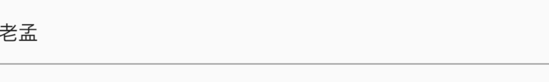

# InputDecorator

定义Material风格文本外观，类似于**TextField**外观，实际上**TextField**包含了此控件。

```dart
InputDecorator(
  decoration: InputDecoration(),
  child: Text('老孟'),
)
```



`decoration`属性是外观装饰，详情查看[InputDecoration](http://laomengit.com/flutter/widgets/InputDecoration.html)


`baseStyle`表示：如果`decoration`不指定样式，则`decoration`的label, hint, counter, and error使用此样式。

`textAlign`：表示水平布局。

`textAlignVertical`：表示垂直布局。

`isFocused`：是否具有焦点。

`isHovering`：输入字段是否被鼠标指针悬停。

`expands`：设置为true，此控件的高度尽可能大。

`isEmpty`：是否为空。

