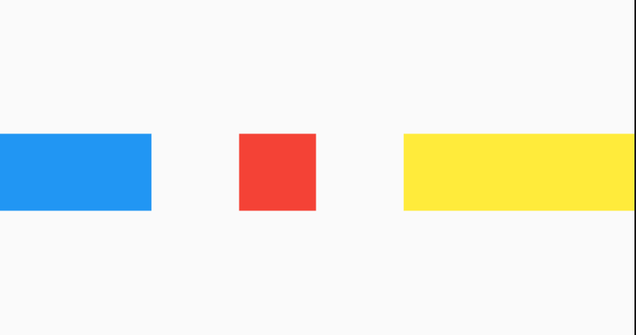

## IntrinsicHeight

根据内部子控件高度来调整高度，它将其子widget的高度调整其本身实际的高度：

将其子控件调整为该子控件的固有高度，举个例子来说，Row中有3个子控件，其中只有一个有高度，默认情况下剩余2个控件将会充满父组件，而使用IntrinsicHeight控件，则3个子控件的高度一致。

此类非常有用，例如，当可以使用无限制的高度并且您希望孩子尝试以其他方式无限扩展以将其自身调整为更合理的高度时，该类非常有用。

  但是此类相对昂贵，因为它在最终布局阶段之前添加了一个推测性布局遍历。 避免在可能的地方使用它。 在最坏的情况下，此小部件可能会导致树的深度的布局为O（N²）。**所以不推荐使用。**

```dart
IntrinsicHeight({ 
   Key key, 
   Widget child 
})
```

用法如下：

```dart
IntrinsicHeight(
  child: Row(
    mainAxisAlignment: MainAxisAlignment.spaceBetween,
    children: <Widget>[
      new Container(color: Colors.blue, width: 100.0),
      new Container(color: Colors.red, width: 50.0,height: 50.0,),
      new Container(color: Colors.yellow, width: 150.0),
    ],
  ),
);
```

没有IntrinsicHeight包裹时第一三个Container高度是不受限制的：


使用IntrinsicHeight包裹时第一三个Container高度就调整到第二个一样的高度：




## IntrinsicWidth

IntrinsicWidth和IntrinsicHeight一样，不过多了2个参数，stepHeight以及stepWidth：

1.  当stepWidth不是null的时候，child的宽度将会是stepWidth的倍数，当stepWidth值比child最小宽度小的时候，这个值不起作用；
2.  当stepWidth为null的时候，child的宽度是child的最小宽度；
3.  当stepHeight不为null的时候，效果跟stepWidth相同；
4.  当stepHeight为null的时候，高度取最大高度。


案例：

```dart
IntrinsicWidth(
  stepHeight: 450.0,
  stepWidth: 300.0,
  child: Column(
    children: <Widget>[
      new Container(color: Colors.blue, height: 100.0),
      new Container(color: Colors.red, width: 150.0, height: 100.0),
      new Container(
        color: Colors.yellow,
        height: 150.0,
      ),
    ],
  ),
)
```


本文由[**Rock**]()提供。


