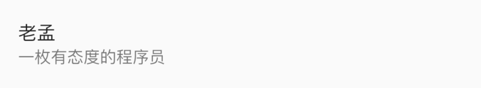
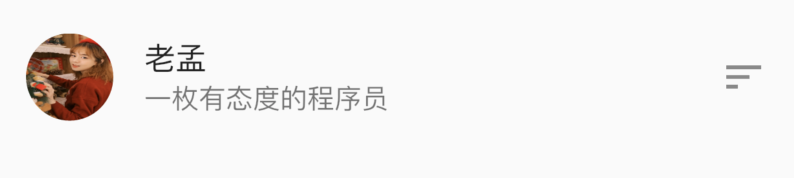
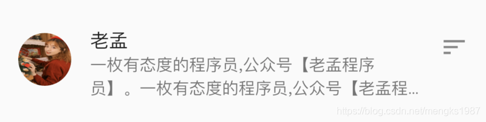

# ListTile

ListTile是遵循Material Design 规范且固定高度的组件，让开发者快速的构建精美的布局，通常用于ListView的子控件，当然也可以单独使用。


添加标题和子标题：

```dart
ListTile(
  title: Text('老孟'),
  subtitle: Text('一枚有态度的程序员'),
)
```

效果如下：



设置头部和尾部的控件：

```
ListTile(
  leading: Container(
    height: 45,
    width: 45,
    decoration: BoxDecoration(
        shape: BoxShape.circle,
        image: DecorationImage(image: AssetImage('images/2.png'),fit: BoxFit.fill)),
  ),
  title: Text('老孟'),
  subtitle: Text('一枚有态度的程序员'),
  trailing: Icon(Icons.sort),
)
```

效果如下：



如果`subtitle`的内容过多，官方建议：

> 如果`isThreeLine`设置为false，文本应该不换行。
>
> 如果`isThreeLine`设置为true，文本应该最大显示2行。

按照官方建议`isThreeLine`设置为false：

```dart
ListTile(
      leading: Container(
        height: 45,
        width: 45,
        decoration: BoxDecoration(
            shape: BoxShape.circle,
            image: DecorationImage(
                image: AssetImage('images/2.png'), fit: BoxFit.fill)),
      ),
      title: Text('老孟'),
      subtitle: Text('一枚有态度的程序员,公众号【老孟程序员】。一枚有态度的程序员,公众号【老孟程序员】。',
          softWrap: false, overflow: TextOverflow.ellipsis),
      trailing: Icon(Icons.sort),
    )
```

效果如下：


`isThreeLine`设置为true：

```dart
ListTile(
  leading: Container(
    height: 45,
    width: 45,
    decoration: BoxDecoration(
        shape: BoxShape.circle,
        image: DecorationImage(
            image: AssetImage('images/2.png'), fit: BoxFit.fill)),
  ),
  title: Text('老孟'),
  subtitle: Text('一枚有态度的程序员,公众号【老孟程序员】。一枚有态度的程序员,公众号【老孟程序员】。',
      maxLines: 2, overflow: TextOverflow.ellipsis),
  isThreeLine: true,
  trailing: Icon(Icons.sort),
)
```

效果如下：



`dense`属性设置为true时，内容及图标将会变小、变得更紧密。`selected`设置为true，文字及图标颜色会发生变化。

最后还可以给ListTile添加单击事件和长按事件：

```dart
ListTile(
  onTap: (){
    print('onTap');
  },
  onLongPress: (){
    print('onLongPress');
  },
  ...
)
```

