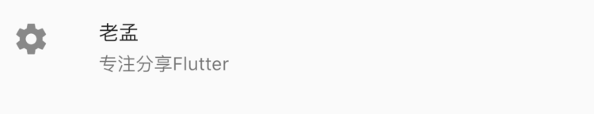

# ListTileTheme

用于控制**ListTile**的样式。

`dense`设置为true时，ListTile高度为紧凑的，和false比较，高度小一些。

```dart
ListTileTheme(
  dense: true,
  child: ListTile(
    leading: Icon(Icons.settings),
    title: Text('老孟'),
    subtitle: Text('专注分享Flutter'),
  ),
)
```



`style`表示适用范围，

- `ListTileStyle.list`：表示此样式用于ListTile
- `ListTileStyle.drawer`：用于**Drawer**中的ListTile

`selectedColor`：选中文字和图标颜色

`iconColor`：图标颜色

`textColor`：字体颜色

`contentPadding`：文本内边距

