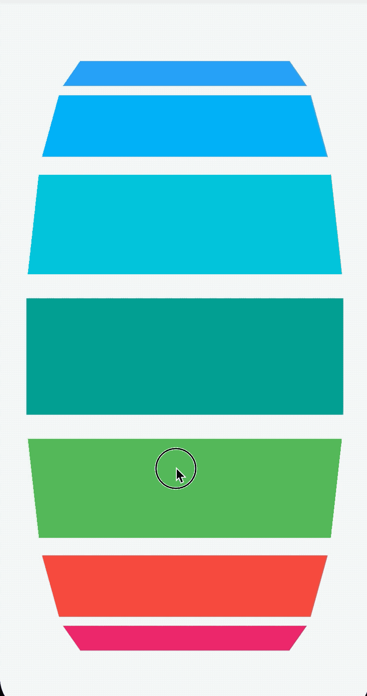
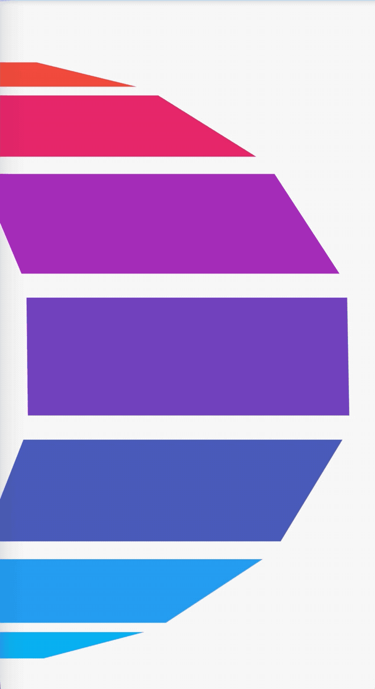
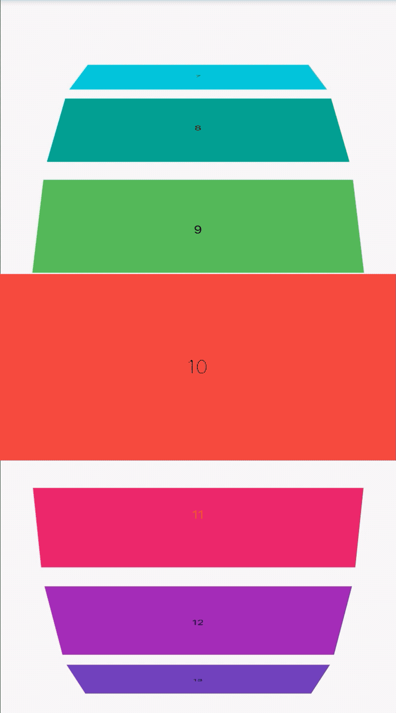

# ListWheelScrollView

在展示大量数据的时候我们第一会想到使用ListView，如果你觉得ListView比较单一、枯燥，你可以使用ListWheelScrollView，ListWheelScrollView和ListView同源，但它的渲染效果类似于车轮（或者滚筒），它不是在平面上滑动，而是转动车轮，先来看一波效果：



ListWheelScrollView的用法和ListView基本相同，基础用法：
```
ListWheelScrollView(
      itemExtent: 150,
      children: <Widget>[
		...
	  ],
    );
```

`children `是子控件，`itemExtent `指定每一个Item的高度。

当有大量数据的时候这种方式明显是不科学的，就像`ListView.builder`一样，用法如下：
```
ListWheelScrollView.useDelegate(
      itemExtent: 150,
      childDelegate: ListWheelChildBuilderDelegate(
          builder: (context, index) {
            return Container(
              margin: EdgeInsets.symmetric(vertical: 10, horizontal: 30),
              color: Colors.primaries[index % 10],
              alignment: Alignment.center,
              child: Text('$index'),
            );
          },
          childCount: 100),
    );
```


## 调整直径

ListWheelScrollView的渲染效果类似车轮，设置`diameterRatio `调整其直径属性：
```
ListWheelScrollView(
      itemExtent: 150,
      diameterRatio: 1,
      children: <Widget>[
        ...
      ],
    )
```
`diameterRatio`是圆筒直径和主轴渲染窗口的尺寸的比，默认值是`2`,如果是垂直方向，主轴渲染窗口的尺寸是ListWheelScrollView的高。diameterRatio越小表示圆筒越圆。

## 调整perspective

`perspective`属性表示圆柱投影透视图，类似OpenGLES中透视投影，理解为看圆柱的距离，为`0`时表示从无限远处看，`1`表示从无限近处看，值的范围(0,0.01]，注意是左开右闭区间，默认值是`0.003`，值越大，渲染效果越圆，用法如下：

```
ListWheelScrollView(
      itemExtent: 150,
      perspective: 0.003,
      children: <Widget>[
        ...
      ],
    );
```

## offAxisFraction

`offAxisFraction `属性表示车轮水平偏离中心的程度，用法如下：

```
ListWheelScrollView(
      itemExtent: 150,
      offAxisFraction: 13,
      children: <Widget>[

      ],
    );
```
`offAxisFraction` 的值从0到2的效果：



## 放大镜

通过`useMagnifier`和`magnification`属性实现放大镜效果，`useMagnifier`是否启用放大镜，`magnification`属性是放大倍率，用法如下：
```
ListWheelScrollView(
      itemExtent: 150,
      useMagnifier: true,
      magnification: 1.5,
      children: <Widget>[

      ],
    );
```
效果如下：



## squeeze

`squeeze`属性表示车轮上的子控件数量与在同等大小的平面列表上的子控件数量之比，例如，如果高度为100px，[itemExtent]为20px，那么5个项将放在一个等效的平面列表中。当`squeeze`为1时，RenderListWheelViewport中也会显示5个子控件。当`squeeze`为2时，RenderListWheelViewport中将显示10个子控件，默认值为1，用法如下：

```
ListWheelScrollView(
      itemExtent: 150,
      squeeze: 1,
      children: <Widget>[

      ],
    );
```


