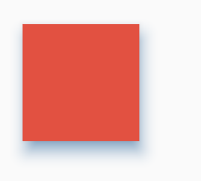
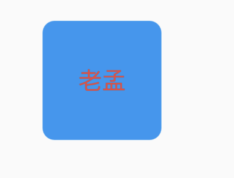

# Material

一个Material风格的组件，`Card`组件就是基于此组件实现。

```dart
Material(
  type: MaterialType.card,
  color: Colors.red,
  child: Container(
    height: 100,
    width: 100,
  ),
)
```


`type`表示组件类型，此属性影响形状和默认颜色值说明如下：

- card：圆角，默认使用`Card`主题颜色。
- canvas：矩形。
- circle：圆形，默认没有颜色，通常用于`floating action button`
- button：圆角，默认没有颜色，通常用于`MaterialButton`
- transparency：透明，使用水波纹和高亮颜色绘制。


设置Z轴值和阴影颜色：

```dart
Material(
  color: Colors.red,
  elevation: 10,
  shadowColor: Colors.blue,
  child: Container(
    height: 100,
    width: 100,
  ),
)
```



设置圆角及字体样式：

```dart
Material(
  borderRadius: BorderRadius.circular(10),
  color: Colors.blue,
  textStyle: TextStyle(fontSize: 20, color: Colors.red),
  child: Container(
    height: 100,
    width: 100,
    alignment: Alignment.center,
    child: Text('老孟'),
  ),
)
```



`animationDuration`表示动画之行时常，`shape`、`elevation`、`shadowColor`属性发生变化时使用此动画时常，用法如下：

```dart
double _radius = 0.0;
Color _color = Colors.blue;

@override
Widget build(BuildContext context) {
  return Column(
    children: <Widget>[
      RaisedButton(
        onPressed: () {
          setState(() {
            _radius = 30.0;
            _color = Colors.red;
          });
        },
      ),
      Material(
        borderRadius: BorderRadius.circular(_radius),
        shadowColor: _color,
        color: Colors.green,
        animationDuration: Duration(seconds: 1),
        child: Container(
          height: 100,
          width: 100,
          alignment: Alignment.center,
          child: Text('老孟'),
        ),
      )
    ],
  );
}
```


