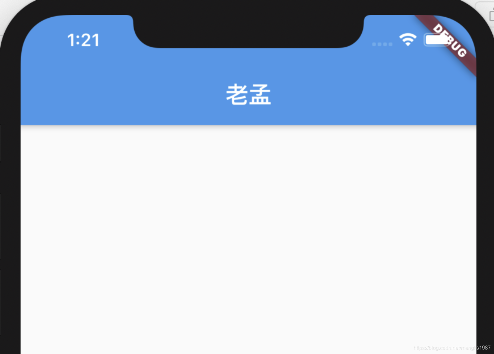
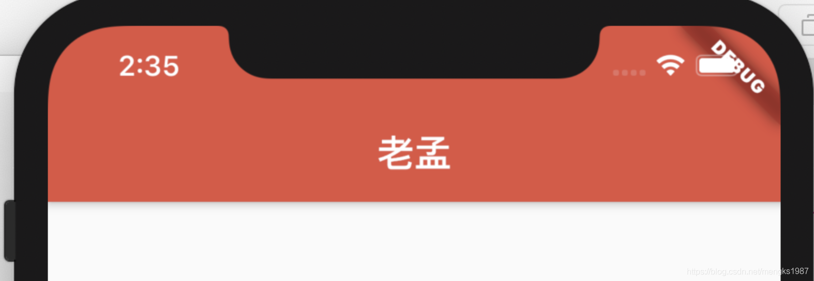
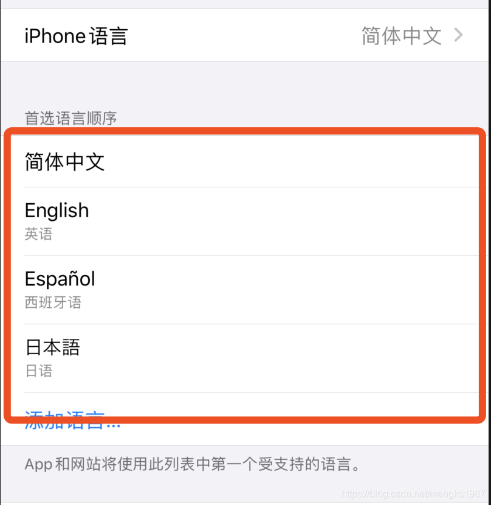
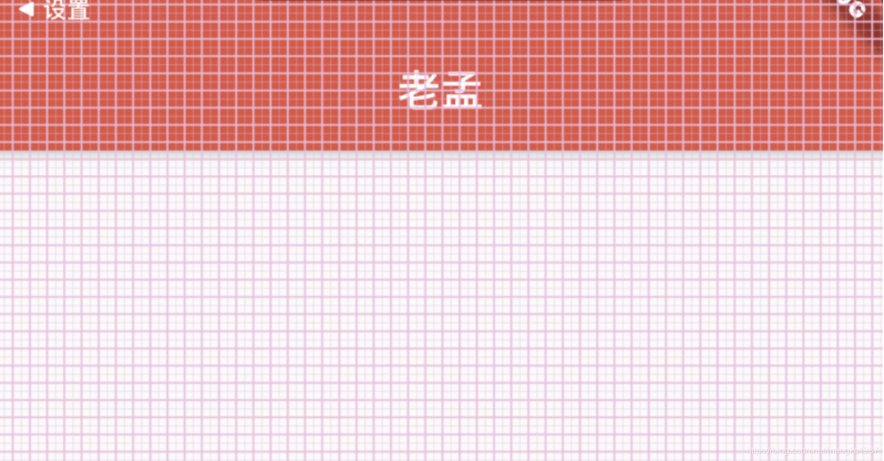
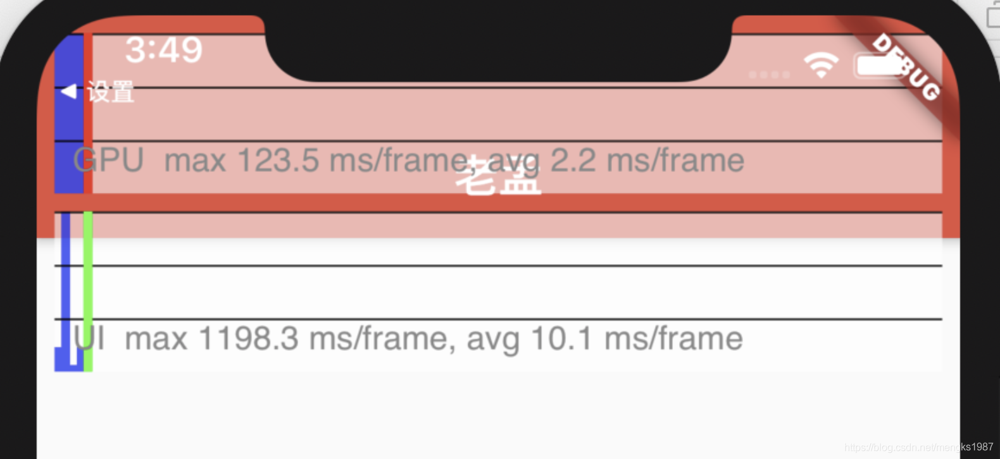

## MaterialApp

在学习Flutter的过程中我们第一个看见的控件应该就是MaterialApp，毕竟创建一个新的Flutter项目的时候，项目第一个组件就是MaterialApp，这是一个Material风格的根控件，基本用法如下：

```dart
MaterialApp(
  home: Scaffold(
    appBar: AppBar(
      title: Text('老孟'),
    ),
  ),
)
```

`home`参数是App默认显示的页面，效果如下：



`title`参数是应用程序的描述，在Android上，在任务管理器的应用程序快照上面显示，在IOS上忽略此属性，IOS上任务管理器应用程序快照上面显示的是`Info.plist`文件中的`CFBundleDisplayName`。如果想根据区域显示不同的描述使用`onGenerateTitle`，用法如下：

```dart
MaterialApp(
  title: '老孟',
  onGenerateTitle: (context) {
    var local = Localizations.localeOf(context);
    if (local.languageCode == 'zh') {
      return '老孟';
    }
    return 'laomeng';
  },
  ...
)
```

`routes`、`initialRoute`、`onGenerateRoute`、`onUnknownRoute`是和路由相关的4个属性，路由简单的理解就是页面，路由的管理通常是指页面的管理，比如跳转、返回等。

MaterialApp按照如下的规则匹配路由：

1. 路由为`/`，`home`不为null则使用`home`。
2. 使用`routes`指定的路由。
3. 使用`onGenerateRoute`生成的路由，处理除`home`和`routes`以外的路由。
4. 如果上面都不匹配则调用`onUnknownRoute`。


是不是还是比较迷糊，不要紧，看下面的例子就明白了：

```dart
MaterialApp(
  routes: {
    'container': (context) => ContainerDemo(),
    'fitted': (context) => FittedBoxDemo(),
    'icon': (context) => IconDemo(),
  },
  initialRoute: '/',
  home: Scaffold(
    appBar: AppBar(
      title: Text('老孟'),
    ),
  ),
  onGenerateRoute: (RouteSettings routeSettings){
        print('onGenerateRoute:$routeSettings');
        if(routeSettings.name == 'icon'){
          return MaterialPageRoute(builder: (context){
            return IconDemo();
          });
        }
      },
      onUnknownRoute: (RouteSettings routeSettings){
        print('onUnknownRoute:$routeSettings');
        return MaterialPageRoute(builder: (context){
          return IconDemo();
        });
      },
  ...
)
```

`initialRoute`设置为`/`，那么加载`home`页面。

如果`initialRoute`设置为`icon`，在`routes`中存在，所以加载`routes`中指定的路由，即IconDemo页面。

如果`initialRoute`设置为`icons1`,此时`routes`中并不存在名称为`icons1`的路由，调用`onGenerateRoute`，如果`onGenerateRoute`返回路由页面，则加载此页面，如果返回的是null，且`home`不为null，则加载`home`参数指定的页面，如果`home`为null，则回调`onUnknownRoute`。

`theme`、`darkTheme`、`themeMode`是关于主题的参数，设置整个App的主题，包括颜色、字体、形状等，修改主题颜色为红色用法如下：

```dart
MaterialApp(
  theme: ThemeData(
    primaryColor: Colors.red
  ),
  darkTheme: ThemeData(
      primaryColor: Colors.red
  ),
  themeMode: ThemeMode.dark,
```

效果如下：




`locale`、`localizationsDelegates`、`localeListResolutionCallback`、`localeResolutionCallback`、`supportedLocales`是区域设置和国际化相关的参数，如果App支持多国语言，那么就需要设置这些参数，默认情况下，Flutter仅支持美国英语，如果想要添加其他语言支持则需要指定其他MaterialApp属性，并引入flutter_localizations 包，到2019年4月，flutter_localizations包已经支持52种语言，如果你想让你的应用在iOS上顺利运行，那么你还必须添加“flutter_cupertino_localizations”包。

在`pubspec.yaml`文件中添加包依赖：

```dart
dependencies:
  flutter:
    sdk: flutter
  flutter_localizations:
    sdk: flutter
  flutter_cupertino_localizations: ^1.0.1

```

设置如下：

```dart
MaterialApp(
  localizationsDelegates: [
    GlobalMaterialLocalizations.delegate,
    GlobalWidgetsLocalizations.delegate,
    GlobalCupertinoLocalizations.delegate
  ],
  supportedLocales: [
    const Locale('zh', 'CH'),
    const Locale('en', 'US'),
  ],
  ...
)
```


- GlobalMaterialLocalizations.delegate ：为Material Components库提供了本地化的字符串和其他值。
- GlobalWidgetsLocalizations.delegate：定义widget默认的文本方向，从左到右或从右到左。
- GlobalCupertinoLocalizations.delegate：为Cupertino（ios风格）库提供了本地化的字符串和其他值。

`supportedLocales`参数指定了当前App支持的语言。


`localeResolutionCallback`和`localeListResolutionCallback`都是对语言变化的监听，比如切换系统语言等，`localeResolutionCallback`和`localeListResolutionCallback`的区别是`localeResolutionCallback`返回的第一个参数是当前语言的Locale，而`localeListResolutionCallback`返回当前手机支持的语言集合，在早期的版本手机没有支持语言的集合，只显示当前语言，在设置->语言和地区的设置选项效果如下：



在早期是没有红色区域的。

因此我们只需使用`localeListResolutionCallback`即可，通过用户手机支持的语言和当前App支持的语言返回一个语言选项。

通常情况下，如果用户的语言正好是App支持的语言，那么直接返回此语言，如果不支持，则返回一个默认的语言，用法如下：

```dart
MaterialApp(
  localeListResolutionCallback:
      (List<Locale> locales, Iterable<Locale> supportedLocales) {
    if (locales.contains('zh')) {
      return Locale('zh');
    }
    return Locale('en');
  },
  ...
)
```

在App中也可以通过如下方法获取区域设置：

```dart
Locale myLocale = Localizations.localeOf(context);
```

还有几个方便调试的选项，debugShowMaterialGrid：打开网格调试

```dart
MaterialApp(
  debugShowMaterialGrid: true,
```

效果如下：



showPerformanceOverlay：打开性能检测

```dart
MaterialApp(
  showPerformanceOverlay: true,
```

效果如下：



右上角有一个DEBUG的标识，这是系统在debug模式下默认显示的，不显示的设置如下：

```dart
MaterialApp(
  debugShowCheckedModeBanner: true,
  ...
)
```


## CupertinoApp

我想你一定能想到既然有Material风格的MaterialApp，那么也应该有Cupertino（ios）风格与之相对应，是的Cupertino风格的是CupertinoApp，CupertinoApp的属性及用法和MaterialApp一模一样，就不在具体介绍了。