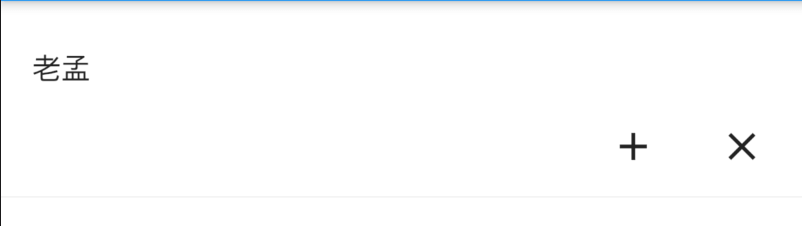
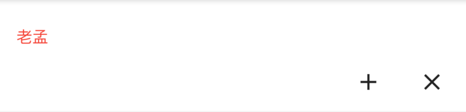

# MaterialBanner

Material 风格的标语（Banner）控件

基本用法：

```dart
MaterialBanner(
  content: Text('老孟'),
  actions: <Widget>[
    IconButton(icon: Icon(Icons.add),onPressed: (){},),
    IconButton(icon: Icon(Icons.close),onPressed: (){},)
  ],
)
```



设置内容样式：

```dart
MaterialBanner(
  contentTextStyle: TextStyle(color: Colors.red),
  content: Text('老孟'),
  actions: <Widget>[
    IconButton(icon: Icon(Icons.add),onPressed: (){},),
    IconButton(icon: Icon(Icons.close),onPressed: (){},)
  ],
)
```



添加开头图标及内边距：

```dart
MaterialBanner(
  leading: IconButton(
    icon: Icon(Icons.person),
    onPressed: (){},
  ),
  leadingPadding: EdgeInsets.all(5),
  content: Text('老孟'),
  actions: <Widget>[
    IconButton(
      icon: Icon(Icons.add),
      onPressed: () {},
    ),
    IconButton(
      icon: Icon(Icons.close),
      onPressed: () {},
    )
  ],
)
```


