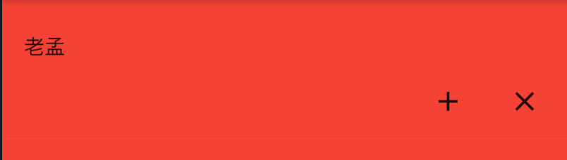

# MaterialBannerTheme

用于控制**MaterialBanner**组件的样式。

```dart
MaterialBannerTheme(
  data: MaterialBannerTheme.of(context)
      .copyWith(backgroundColor: Colors.red),
  child: MaterialBanner(
    content: Text('老孟'),
    actions: <Widget>[
      IconButton(
        icon: Icon(Icons.add),
        onPressed: () {},
      ),
      IconButton(
        icon: Icon(Icons.close),
        onPressed: () {},
      )
    ],
  ),
)
```




## MaterialBannerThemeData

属性说明如下：

```dart
const MaterialBannerThemeData({
  this.backgroundColor,//背景颜色
  this.contentTextStyle,//内容文本样式
  this.padding,//内边距
  this.leadingPadding,// leading 内边距
})
```

