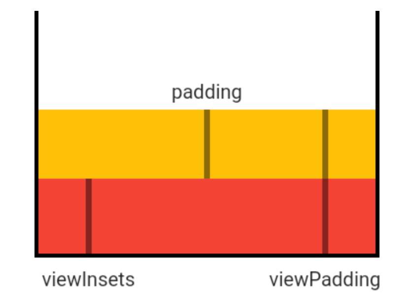
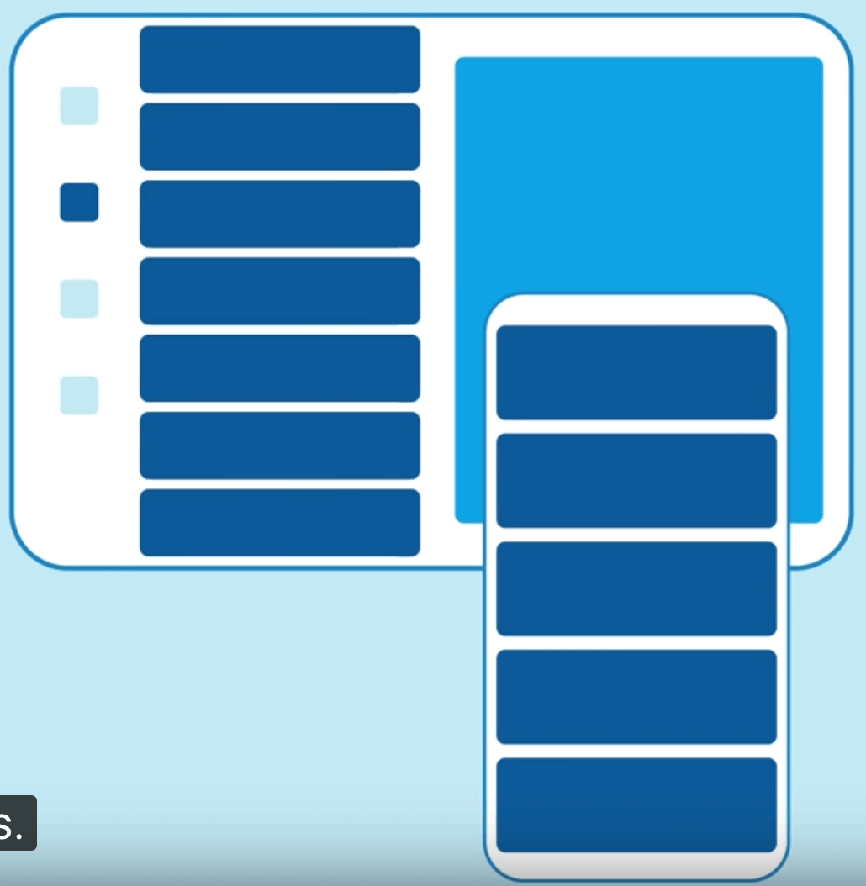

## MediaQuery 

通常情况下，不会直接将MediaQuery当作一个控件，而是使用`MediaQuery.of`获取当前设备的信息，用法如下：

```dart
var data = MediaQuery.of(context);
```

此方式必须放在MediaQuery作用域内，否则会抛出异常，MaterialApp和WidgetsApp都引入了MediaQuery，并且随着屏幕的变化而导致重建，比如旋转屏幕、弹出输入框等。

## MediaQueryData

MediaQueryData是`MediaQuery.of`获取数据的类型。说明如下：

| 属性                  | 说明                                                         |
| :-------------------- | ------------------------------------------------------------ |
| size                  | 逻辑像素，并不是物理像素，类似于Android中的dp，逻辑像素会在不同大小的手机上显示的大小基本一样，物理像素 = size*devicePixelRatio。 |
| devicePixelRatio      | 单位逻辑像素的物理像素数量，即设备像素比。                   |
| textScaleFactor       | 单位逻辑像素字体像素数，如果设置为1.5则比指定的字体大50%。   |
| platformBrightness    | 当前设备的亮度模式，比如在Android Pie手机上进入省电模式，所有的App将会使用深色（dark）模式绘制。 |
| viewInsets            | 被系统遮挡的部分，通常指键盘，弹出键盘，`viewInsets.bottom`表示键盘的高度。 |
| padding               | 被系统遮挡的部分，通常指“刘海屏”或者系统状态栏。             |
| viewPadding           | 被系统遮挡的部分，通常指“刘海屏”或者系统状态栏，此值独立于`padding`和`viewInsets`，它们的值从`MediaQuery`控件边界的边缘开始测量。在移动设备上，通常是全屏。 |
| systemGestureInsets   | 显示屏边缘上系统“消耗”的区域输入事件，并阻止将这些事件传递给应用。比如在Android Q手势滑动用于页面导航（ios也一样），比如左滑退出当前页面。 |
| physicalDepth         | 设备的最大深度，类似于三维空间的Z轴。                        |
| alwaysUse24HourFormat | 是否是24小时制。                                             |
| accessibleNavigation  | 用户是否使用诸如TalkBack或VoiceOver之类的辅助功能与应用程序进行交互，用于帮助视力有障碍的人进行使用。 |
| invertColors          | 是否支持颜色反转。                                           |
| highContrast          | 用户是否要求前景与背景之间的对比度高， iOS上，方法是通过“设置”->“辅助功能”->“增加对比度”。   此标志仅在运行iOS 13的iOS设备上更新或以上。 |
| disableAnimations     | 平台是否要求尽可能禁用或减少动画。                           |
| boldText              | 平台是否要求使用粗体。                                       |
| orientation           | 是横屏还是竖屏。                                             |

`padding`、`viewPadding`和`viewInsets`的区别如下：



## 使用场景

### 根据尺寸构建不同的布局

SafeArea控件就是通过`MediaQuery.of`来实现的，平板和手机的（或者横屏和竖屏）布局可能是不一样的，比如如下布局：



布局代码如下：

```dart
var screenSize = MediaQuery.of(context).size;
if(screenSize.width>oneColumnLayout){
  //平板布局
}else{
  //手机布局
}
```

`oneColumnLayout`表示一列布局的宽度。

### 系统字体变化

很多App都有一个功能就是调节字体大小，通过MediaQuery来实现，实现如下：

```dart
@override
  Widget build(BuildContext context) {
    var _data = MediaQuery.of(context).copyWith(textScaleFactor: 2.0);
    return Scaffold(
      appBar: AppBar(
        title: Text('老孟'),
      ),
      body: MediaQuery(
        data: _data,
        child: Text('字体变大'),
      ),
    );
  }
```

我们发现字体变大了一倍。