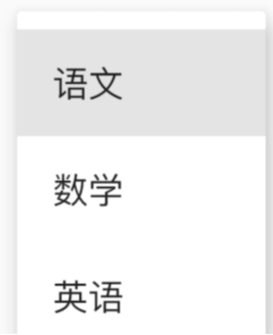
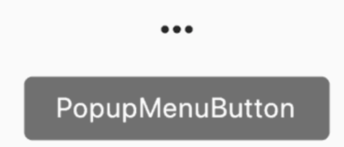
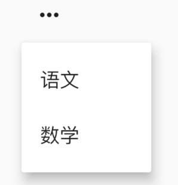
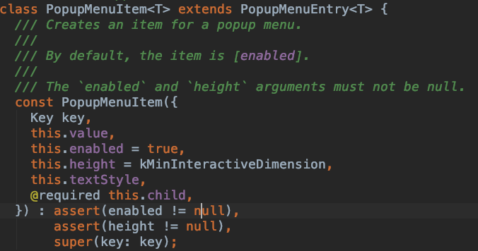
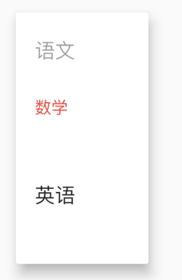
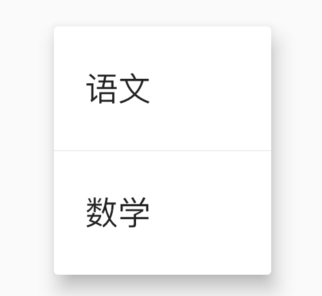
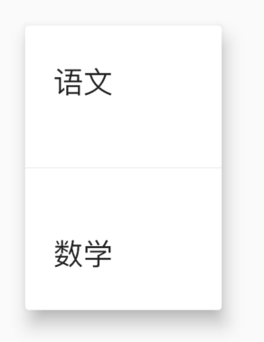
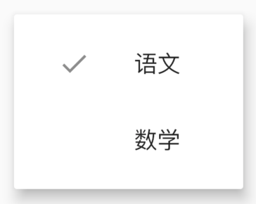
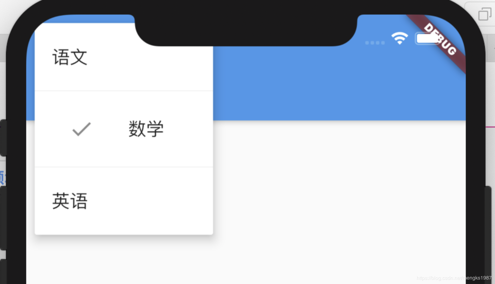

# Menu

在Flutter中提供了两种方式来完成弹出菜单功能。

## PopupMenuButton

使用PopupMenuButton，点击时弹出菜单，用法如下：

```dart
PopupMenuButton<String>(
  itemBuilder: (context) {
    return <PopupMenuEntry<String>>[
      PopupMenuItem<String>(
        value: '语文',
        child: Text('语文'),
      ),
      PopupMenuItem<String>(
        value: '数学',
        child: Text('数学'),
      ),
      PopupMenuItem<String>(
        value: '英语',
        child: Text('英语'),
      ),
      PopupMenuItem<String>(
        value: '生物',
        child: Text('生物'),
      ),
      PopupMenuItem<String>(
        value: '化学',
        child: Text('化学'),
      ),
    ];
  },
)
```

效果如下：


设置其初始值：

```dart
PopupMenuButton<String>(
  initialValue: '语文',
  ...
)
```

设置初始值后，打开菜单后，设置的值将会高亮，效果如下：



获取用户选择了某一项的值，或者用户未选中，代码如下：

```dart
PopupMenuButton<String>(
  onSelected: (value){
    print('$value');
  },
  onCanceled: (){
    print('onCanceled');
  },
  ...
)
```

`tooltip`是长按时弹出的提示，用法如下：

```
PopupMenuButton<String>(
  tooltip: 'PopupMenuButton',
  ...
)
```

效果如下：



设置其阴影值、内边距和弹出菜单的背景颜色：

```dart
PopupMenuButton<String>(
  elevation: 5,
  padding: EdgeInsets.all(5),
  color: Colors.red,
  ...
)
```

默认情况下，PopupMenuButton显示3个小圆点，我们也可以对齐进行设置，设置文字如下：

```dart
PopupMenuButton<String>(
  child: Text('学科'),
  ...
)
```

`child`组件将会被InkWell包裹，点击弹出菜单，效果如下：


也可以设置其他图标：

```dart
PopupMenuButton<String>(
	icon: Icon(Icons.add),
	...
)
```

效果如下：


设置弹出菜单边框：

```dart
PopupMenuButton<String>(
  shape: RoundedRectangleBorder(
    side: BorderSide(
      color: Colors.red
    ),
    borderRadius: BorderRadius.circular(10)
  ),
	...
)
```

效果如下：


menu有一个非常重要的参数`Offset`，这个参数是控制菜单弹出的位置，通常情况下，菜单在当前按钮下面展示：

```dart
PopupMenuButton<String>(
  offset: Offset(0,100),
  itemBuilder: (context) {
    return <PopupMenuEntry<String>>[
      PopupMenuItem<String>(
        value: '语文',
        child: Text('语文'),
      ),
      PopupMenuItem<String>(
        value: '数学',
        child: Text('数学'),
      ),
    ];
  },
)
```



`PopupMenuButton`的每一项都需要是`PopupMenuEntry`类型，`PopupMenuEntry`为抽象类，其子类有PopupMenuItem、PopupMenuDivider、CheckedPopupMenuItem。

###  PopupMenuItem

构造函数为



参数说明：

- value：当此项选中后，此值将会通过`onSelected`返回。
- enabled：此项是否可用。
- height：此项的高度
- textStyle：文本样式
- child：子控件。

用法如下：

```dart
PopupMenuButton<String>(
  onSelected: (value) {
    print('$value');
  },
  itemBuilder: (context) {
    return <PopupMenuEntry<String>>[
      PopupMenuItem<String>(
        value: '语文',
        enabled: false,
        child: Text('语文'),
      ),
      PopupMenuItem<String>(
        value: '数学',
        textStyle: TextStyle(color: Colors.red),
        child: Text('数学'),
      ),
      PopupMenuItem<String>(
        value: '英语',
        height: 100,
        child: Text('英语'),
      ),
    ];
  },
)
```




### PopupMenuDivider

PopupMenuDivider是菜单分割线，用法如下：

```dart
PopupMenuButton<String>(
  onSelected: (value) {
    print('$value');
  },
  itemBuilder: (context) {
    return <PopupMenuEntry<String>>[
      PopupMenuItem<String>(
        value: '语文',
        child: Text('语文'),
      ),
      PopupMenuDivider(),
      PopupMenuItem<String>(
        value: '数学',
        child: Text('数学'),
      ),
    ];
  },
)
```



PopupMenuDivider默认高度为16，注意这个高度并不是分割线的高度，而是分割线控件的高度，设置为50代码：

```dart
PopupMenuDivider(height: 50,),
```




###  CheckedPopupMenuItem

CheckedPopupMenuItem是前面带是否选中的控件，本质就是一个ListTile，用法如下：

```dart
PopupMenuButton<String>(
  onSelected: (value) {
    print('$value');
  },
  itemBuilder: (context) {
    return <PopupMenuEntry<String>>[
      CheckedPopupMenuItem(
        value: '语文',
        checked: true,
        child: Text('语文'),
      ),
      CheckedPopupMenuItem(
        value: '数学',
        child: Text('数学'),
      ),
    ];
  },
)
```




## showMenu

如果你看下`PopupMenuButton`的源码会发现，`PopupMenuButton`也是使用showMenu实现的，用法如下：

```dart
showMenu(
    context: context,
    position: RelativeRect.fill,
    items: <PopupMenuEntry>[
      PopupMenuItem(child: Text('语文')),
      PopupMenuDivider(),
      CheckedPopupMenuItem(
        child: Text('数学'),
        checked: true,
      ),
      PopupMenuDivider(),
      PopupMenuItem(child: Text('英语')),
    ]);
```

`position`参数表示弹出的位置，效果如下：




属性和`PopupMenuButton`基本一样，但使用`showMenu`需要我们指定位置，所以一般情况下，我们不会直接使用`showMenu`，而是使用`PopupMenuButton`，免去了计算位置的过程。

看下`PopupMenuButton`是如何计算的，有助于帮助我们理解：

```dart
final PopupMenuThemeData popupMenuTheme = PopupMenuTheme.of(context);
    final RenderBox button = context.findRenderObject();
    final RenderBox overlay = Overlay.of(context).context.findRenderObject();
    final RelativeRect position = RelativeRect.fromRect(
      Rect.fromPoints(
        button.localToGlobal(widget.offset, ancestor: overlay),
        button.localToGlobal(button.size.bottomRight(Offset.zero), ancestor: overlay),
      ),
      Offset.zero & overlay.size,
    );
    final List<PopupMenuEntry<T>> items = widget.itemBuilder(context);
```


