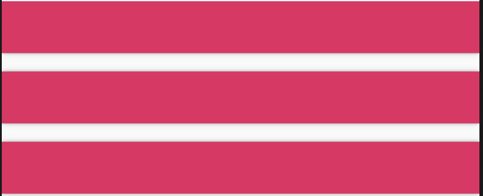
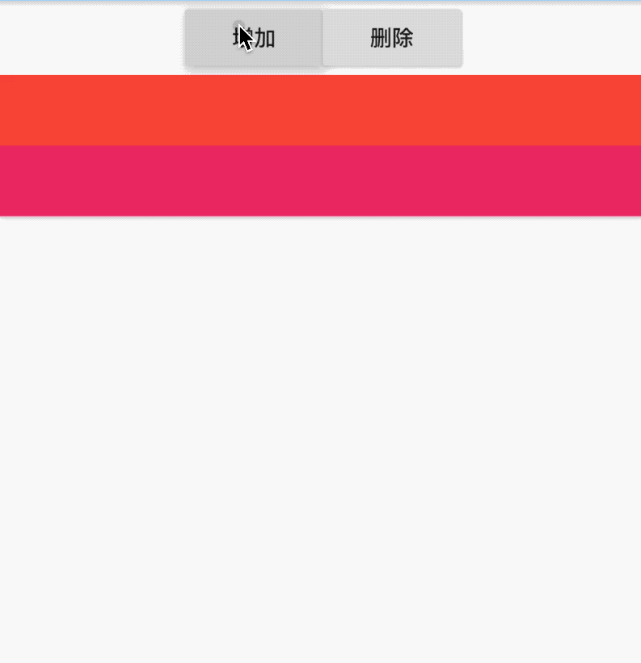
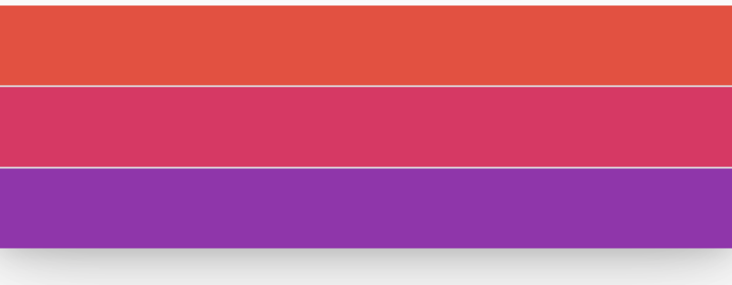
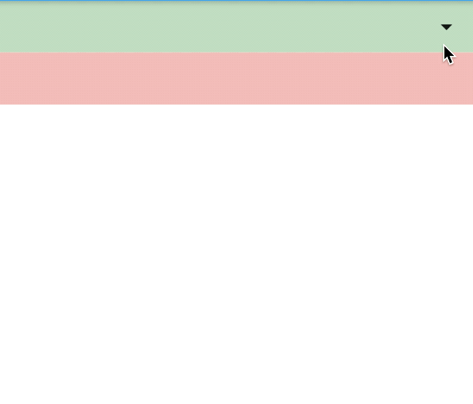

# MergeableMaterial

MergeableMaterial 展示一些MergeableMaterialItem组件，当子组件发生变化时，动画打开或者关闭，MergeableMaterial的父控件需要在主轴方向是一个没有限制的控件，比如SingleChildScrollView、Row、Column等。

基本用法如下：

```dart
SingleChildScrollView(
  child: MergeableMaterial(
    children: [
      MaterialSlice(
          key: ValueKey(1),
          child: Container(
            height: 45,
            color: Colors.primaries[1 % Colors.primaries.length],
          )),
      MaterialGap(key: ValueKey(2)),
      MaterialSlice(
          key: ValueKey(3),
          child: Container(
            height: 45,
            color: Colors.primaries[1 % Colors.primaries.length],
          )),
      MaterialGap(key: ValueKey(4)),
      MaterialSlice(
          key: ValueKey(5),
          child: Container(
            height: 45,
            color: Colors.primaries[1 % Colors.primaries.length],
          )),
    ],
  ),
)
```

效果如下：



MergeableMaterial的子控件只能是MaterialSlice和MaterialGap，MaterialSlice是带子控件的控件，显示实际内容，MaterialGap用于分割，只能放在MaterialSlice中间。


静态情况下，看不出具体的效果，动态改变子组件用法如下：

```dart
List<MergeableMaterialItem> items = [];
List.generate(_count, (index) {
  items.add(MaterialSlice(
      key: ValueKey(index * 2),
      child: Container(
        height: 45,
        color: Colors.primaries[index % Colors.primaries.length],
      )));
});

return SingleChildScrollView(
  child: MergeableMaterial(
    children: items,
  ),
)
```

效果如下：



主要看增加/删除子组件时的动画效果。

增加分割线和阴影：

```dart
MergeableMaterial(
  hasDividers: true,
  elevation: 24,
  children: items,
)
```

效果如下：



阴影值不能随便设置，只能设置如下值：1, 2, 3, 4, 6, 8, 9, 12, 16, 24

此控件可以实现什么样的效果呢？看下面效果：



实现代码：

```dart
bool _expand = false;

@override
Widget build(BuildContext context) {
  return Column(
    children: <Widget>[
      Container(
        height: 45,
        color: Colors.green.withOpacity(.3),
        alignment: Alignment.centerRight,
        child: IconButton(
          icon: Icon(Icons.arrow_drop_down),
          onPressed: () {
            setState(() {
              _expand = !_expand;
            });
          },
        ),
      ),
      _expand
          ? MergeableMaterial(
              hasDividers: true,
              elevation: 24,
              children: [
                MaterialSlice(
                    key: ValueKey(1),
                    child: Container(
                      height: 200,
                      color: Colors.green.withOpacity(.3),
                    ))
              ],
            )
          : Container(),
      Container(
        height: 45,
        color: Colors.red.withOpacity(.3),
      ),
    ],
  );
}
```

看到这个效果是否想到了ExpansionPanelList呢？系统控件ExpansionPanelList就是使用此控件实现的。

