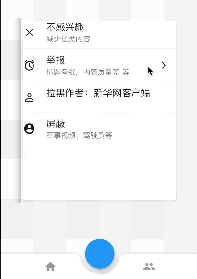

# Navigator


Navigator 是管理路由的控件，通常情况下直接使用`Navigator.of(context)`的方法来跳转页面，之所以可以直接使用`Navigator.of(context)`是因为在`WidgetsApp`中使用了此控件，应用程序的根控件通常是`MaterialApp`，`MaterialApp`包含`WidgetsApp`，所以可以直接使用Navigator的相关属性。


Navigator用法非常简单，如下：

```dart
Navigator(
  initialRoute: '/',
  onGenerateRoute: (RouteSettings settings) {
    WidgetBuilder builder;
    switch (settings.name) {
      case 'home':
        builder = (context) => PageA();
        break;
      case 'user':
        builder = (context) => PageB();
        break;
    }
    return MaterialPageRoute(builder: builder, settings: settings);
  },
)
```

`initialRoute`表示初始化路由，`onGenerateRoute`表示根据**RouteSettings**生成路由。

那么在什么情况下需要使用Navigator？在需要局部页面跳转的地方使用Navigator，如下面的场景：


## 头条客户端举报场景

头条客户端每一个新闻下面都有一个“叉号”，点击弹出相关信息，点击其中的局部，会在当前小窗户内跳转到举报页面，效果如下：


此场景就是使用Navigator的典型场景，点击举报，并不是全屏切换页面，而是仅仅在当前弹出的页面进行切换。

首页代码如下：

```dart
@override
Widget build(BuildContext context) {
  return Center(
    child: Container(
      height: 350,
      width: 300,
      child: Navigator(
        initialRoute: '/',
        onGenerateRoute: (RouteSettings settins) {
          WidgetBuilder builder;
          switch (settins.name) {
            case '/':
              builder = (context) => PageC();
              break;
          }
          return MaterialPageRoute(builder: builder);
        },
      ),
    ),
  );
}
```

`Navigator`的初始化路由为**PageC**页面，**PageC**页面代码如下：

```dart
class PageC extends StatelessWidget {
  @override
  Widget build(BuildContext context) {
    return Center(
      child: Card(
        child: Column(
          children: <Widget>[
            _buildItem(Icons.clear, '不感兴趣', '减少这类内容'),
            Divider(),
            _buildItem(Icons.access_alarm, '举报', '标题夸张，内容质量差 等',
                showArrow: true, onPress: () {
              Navigator.of(context).push(MaterialPageRoute(builder: (context) {
                return PageD();
              }));
            }),
            Divider(),
            _buildItem(Icons.perm_identity, '拉黑作者：新华网客户端', ''),
            Divider(),
            _buildItem(Icons.account_circle, '屏蔽', '军事视频、驾驶员等'),
          ],
        ),
      ),
    );
  }

  _buildItem(IconData iconData, String title, String content,
      {bool showArrow = false, Function onPress}) {
    return Row(
      children: <Widget>[
        Icon(iconData),
        SizedBox(
          width: 20,
        ),
        Expanded(
          child: Column(
            crossAxisAlignment: CrossAxisAlignment.start,
            children: <Widget>[
              Text(
                title,
                style: TextStyle(fontSize: 18),
              ),
              Text(
                content,
                style: TextStyle(
                    color: Colors.black.withOpacity(.5), fontSize: 14),
              )
            ],
          ),
        ),
        !showArrow
            ? Container()
            : IconButton(
                icon: Icon(Icons.arrow_forward_ios),
                iconSize: 16,
                onPressed: onPress,
              ),
      ],
    );
  }
}
```

**PageC**页面跳转到**PageD**页面，**PageD**页面代码如下：

```dart
class PageD extends StatelessWidget {
  @override
  Widget build(BuildContext context) {
    return Container(
      height: 200,
      width: 250,
      color: Colors.grey.withOpacity(.5),
      child: Column(
        children: <Widget>[
          Row(
            children: <Widget>[
              IconButton(
                icon: Icon(Icons.arrow_back_ios),
                onPressed: () {
                  Navigator.of(context).pop();
                },
              ),
              Text('返回'),
              SizedBox(
                width: 30,
              ),
              Text('举报'),
            ],
          ),
        ],
      ),
    );
  }
}
```




最终实现了局部跳转效果，只在中间区域变化，其他区域不变。


## Tab内跳转

还有一个典型到应用场景就Tab内跳转，效果如下：


底部导航一直存在，每个tab都有自己的导航器。

首页代码如下：

```dart
class TabMain extends StatefulWidget {
  @override
  State<StatefulWidget> createState() => _TabMainState();
}

class _TabMainState extends State<TabMain> {
  int _currentIndex = 0;

  @override
  Widget build(BuildContext context) {
    return Scaffold(
      body: IndexedStack(
        index: _currentIndex,
        children: <Widget>[
          TabNavigator(0),
          TabNavigator(1),
          TabNavigator(2),
        ],
      ),
      bottomNavigationBar: BottomNavigationBar(
        onTap: (int index) {
          setState(() {
            _currentIndex = index;
          });
        },
        currentIndex: _currentIndex,
        items: <BottomNavigationBarItem>[
          BottomNavigationBarItem(title: Text('首页'), icon: Icon(Icons.home)),
          BottomNavigationBarItem(title: Text('书籍'), icon: Icon(Icons.book)),
          BottomNavigationBarItem(
              title: Text('我的'), icon: Icon(Icons.perm_identity)),
        ],
      ),
    );
  }
}
```

首页定义了3个tab及切换效果。


定义TabNavigator：

```dart
class TabNavigator extends StatelessWidget {
  TabNavigator(this.index);

  final int index;

  @override
  Widget build(BuildContext context) {
    return Navigator(
      initialRoute: '/',
      onGenerateRoute: (RouteSettings settins) {
        WidgetBuilder builder;
        switch (settins.name) {
          case '/':
            builder = (context) => ListPage(index);
            break;
        }
        return MaterialPageRoute(builder: builder);
      },
    );
  }
}
```


列表页面，此页面一般为List页面，点击其中一个跳转到相关详情页面，这里为了简便，只放了一个跳转按钮：

```dart
class ListPage extends StatelessWidget {
  ListPage(this.index);

  final int index;

  @override
  Widget build(BuildContext context) {
    return Scaffold(
      appBar: AppBar(),
      body: Center(
        child: RaisedButton(
          child: Text('$index'),
          onPressed: () {
            Navigator.of(context).push(MaterialPageRoute(builder: (context) {
              return DetailPage();
            }));
          },
        ),
      ),
    );
  }
}
```

详情页面

```dart
class DetailPage extends StatelessWidget {
  @override
  Widget build(BuildContext context) {
    return Scaffold(
      appBar: AppBar(),
      body: Center(
        child: Text('DetailPage'),
      ),
    );
  }
}
```


虽然Navigator控件不是特别常用，但在一些场景下非常适用。