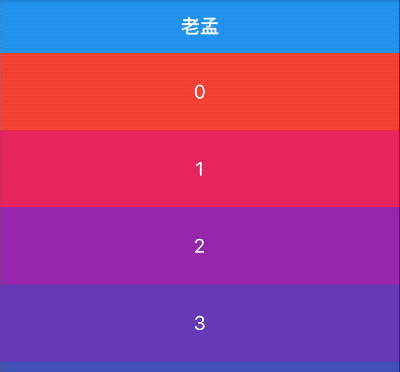
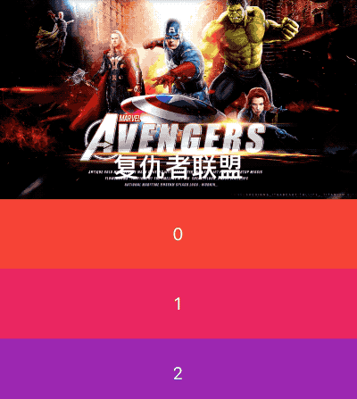

# NestedScrollView

可以在其内部嵌套其他滚动视图的滚动视图，其滚动位置是固有链接的。

在普通的[ScrollView]中， 如果有一个Sliver组件容纳了一个[TabBarView]，它沿相反的方向滚动（例如，允许用户在标签所代表的页面之间水平滑动，而列表则垂直滚动），则该[TabBarView]内部的任何列表都不会相互作用 与外部[ScrollView]。 例如，浏览内部列表以滚动到顶部不会导致外部[ScrollView]中的[SliverAppBar]折叠以展开。

## 滚动隐藏AppBar

用法如下：

```dart
NestedScrollView(
  headerSliverBuilder: (BuildContext context, bool innerBoxIsScrolled) {
    return <Widget>[SliverAppBar(
      title: Text('老孟'),
    )];
  },
  body: ListView.builder(itemBuilder: (BuildContext context,int index){
    return Container(
      height: 80,
      color: Colors.primaries[index % Colors.primaries.length],
      alignment: Alignment.center,
      child: Text(
        '$index',
        style: TextStyle(color: Colors.white, fontSize: 20),
      ),
    );
  },itemCount: 20,),
)
```

效果如下：




## SliverAppBar展开折叠

用法如下：

```dart
NestedScrollView(
  headerSliverBuilder: (BuildContext context, bool innerBoxIsScrolled) {
    return <Widget>[SliverAppBar(
      expandedHeight: 230.0,
      pinned: true,
      flexibleSpace: FlexibleSpaceBar(
        title: Text('复仇者联盟'),
        background: Image.network(
          'http://img.haote.com/upload/20180918/2018091815372344164.jpg',
          fit: BoxFit.fitHeight,
        ),
      ),
    )];
  },
  body: ListView.builder(itemBuilder: (BuildContext context,int index){
    return Container(
      height: 80,
      color: Colors.primaries[index % Colors.primaries.length],
      alignment: Alignment.center,
      child: Text(
        '$index',
        style: TextStyle(color: Colors.white, fontSize: 20),
      ),
    );
  },itemCount: 20,),
)
```

效果如下：



## 与TabBar配合使用

用法如下：

```dart
NestedScrollView(
  headerSliverBuilder: (BuildContext context, bool innerBoxIsScrolled) {
    return <Widget>[
      SliverAppBar(
        expandedHeight: 230.0,
        pinned: true,
        flexibleSpace: Padding(
          padding: EdgeInsets.symmetric(vertical: 8),
          child: PageView(),
        ),
      ),
      SliverPersistentHeader(
        pinned: true,
        delegate: StickyTabBarDelegate(
          child: TabBar(
            labelColor: Colors.black,
            controller: this._tabController,
            tabs: <Widget>[
              Tab(text: '资讯'),
              Tab(text: '技术'),
            ],
          ),
        ),
      ),
    ];
  },
  body: TabBarView(
    controller: this._tabController,
    children: <Widget>[
      RefreshIndicator(
        onRefresh: (){
          print(('onRefresh'));
        },
        child: _buildTabNewsList(_newsKey, _newsList),
      ),

      _buildTabNewsList(_technologyKey, _technologyList),
    ],
  ),
)
```

StickyTabBarDelegate 代码如下：

```dart
class StickyTabBarDelegate extends SliverPersistentHeaderDelegate {
  final TabBar child;

  StickyTabBarDelegate({@required this.child});

  @override
  Widget build(
      BuildContext context, double shrinkOffset, bool overlapsContent) {
    return Container(
      color: Theme.of(context).backgroundColor,
      child: this.child,
    );
  }

  @override
  double get maxExtent => this.child.preferredSize.height;

  @override
  double get minExtent => this.child.preferredSize.height;

  @override
  bool shouldRebuild(SliverPersistentHeaderDelegate oldDelegate) {
    return true;
  }
}
```

效果如下：


通过`scrollDirection`和`reverse`参数控制其滚动方向，用法如下：

```dart
NestedScrollView(
  scrollDirection: Axis.horizontal,
  reverse: true,
  ...
)
```

`scrollDirection`滚动方向，分为垂直和水平方向。


`reverse`参数表示反转滚动方向，并不是有垂直转为水平，而是垂直方向滚动时，默认向下滚动，`reverse`设置false，滚动方向改为向上，同理水平滚动改为水平向左。


`controller`为滚动控制器，可以监听滚到的位置，设置滚动的位置等，用法如下：

```dart
_scrollController = ScrollController();

//监听滚动位置
    _scrollController.addListener((){
      print('${_scrollController.position}');
    });
    //滚动到指定位置
    _scrollController.animateTo(20.0);

CustomScrollView(
	controller: _scrollController,
	...
) 
```


`physics`表示可滚动组件的物理滚动特性，具体查看[ScrollPhysics](http://laomengit.com/flutter/widgets/ScrollPhysics.html)

