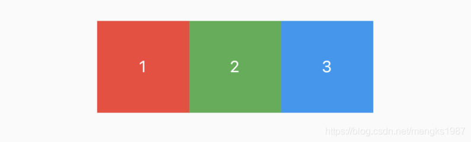
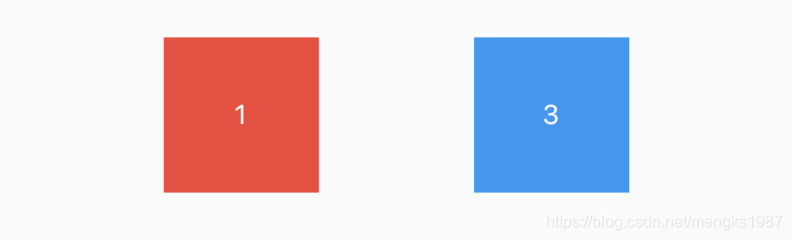

## Opacity

Flutter中移除一个控件非常容易，只需要在重新创建中移除即可，如果想要移除控件同时它的位置依然保留，类似于Android中View的invisible，比如Row中有3个颜色块，分别为1、2、3，代码如下：

```
Row(
      mainAxisAlignment: MainAxisAlignment.center,
      children: <Widget>[
        Container(
          height: 80,
          width: 80,
          color: Colors.red,
          alignment: Alignment.center,
          child: Text('1',style: TextStyle(color: Colors.white),),
        ),
        Container(
          height: 80,
          width: 80,
          color: Colors.green,
          alignment: Alignment.center,
          child: Text('2',style: TextStyle(color: Colors.white),),
        ),
        Container(
          height: 80,
          width: 80,
          color: Colors.blue,
          alignment: Alignment.center,
          child: Text('3',style: TextStyle(color: Colors.white),),
        ),
      ],
    )
```
效果如下：


这时想要移除2，同时还保留2的位置，可以使用Opacity控件实现，代码如下：
```
Opacity(
      opacity: 0.0,
      child:  Container(
        height: 80,
        width: 80,
        color: Colors.green,
        alignment: Alignment.center,
        child: Text('2',style: TextStyle(color: Colors.white),),
      ),
    )
```

效果如下：



使用Opacity控件和另一个控件层叠在一起，将会出现“蒙层效果”：
```
Stack(
      children: <Widget>[
        Image.network(
          'https://timgsa.baidu.com/timg?image&quality=80&size=b9999_10000&sec=1582204321233&di=ac7e8572222e1781cef5ad3add4daead&imgtype=0&src=http%3A%2F%2Fn.sinaimg.cn%2Fsinacn15%2F275%2Fw640h435%2F20181010%2Fcaba-hkrzvkw4936632.jpg',
        ),
        Positioned.fill(
          child: Opacity(
            opacity: 0.5,
            child: Container(
              decoration: BoxDecoration(
                gradient: LinearGradient(
                    colors: [Colors.white, Colors.blue],
                    begin: Alignment.bottomCenter,
                    end: Alignment.topCenter),
              ),
            ),
          ),
        ),
      ],
    )
```

效果如下：


## AnimatedOpacity

甚至我们可以使用AnimatedOpacity控件实现动画效果:

```
bool click = false;
AnimatedOpacity(
      onEnd: () {
        setState(() {
          click = !click;
        });
      },
      duration: Duration(seconds: 3),
      opacity: click ? 0.2 : 0.8,
      child: Container(
        decoration: BoxDecoration(
          gradient: LinearGradient(
            colors: [Colors.white, Colors.grey],
          ),
        ),
      ),
    )
```

动画效果：


